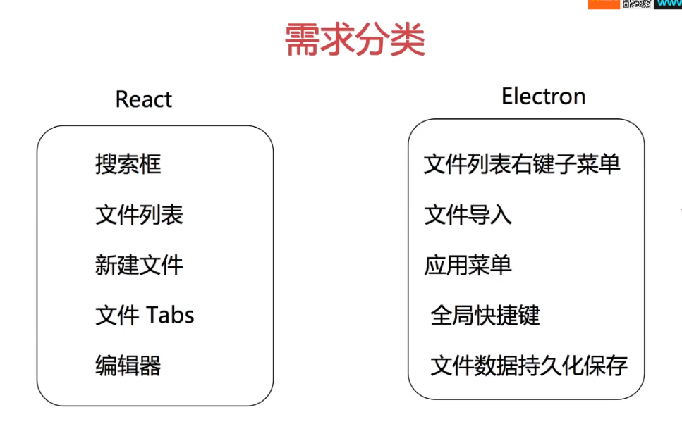

## 小项目需求：

### 需求分析




### React哲学

- 将设计好的UI划分为组件层级

- 创建应用的静态版本

  

### 配置开发环境


1. 创建项目

   ```bash
   npx create-react-app clound-doc
   ```

2. 安装Electron

   ```bash
   yarn add electron --dev
   ```

3. 安装插件，判断是开发环境还是生产环境：

   ```bash
   yarn add electron-is-dev --dev
   ```

   然后在package.json文件中书写启动命令，但是存在一个问题，运行Eletron环境之前需要运行React项目。
   
   ```js
    "scripts": {
       "start": "react-scripts start",
       "build": "react-scripts build",
       "test": "react-scripts test",
       "eject": "react-scripts eject",
       "dev": "electron .",
           
        //两条运行命令整合成一条运行，这个命令在windows下不好用
       "ele":"yarn start & yarn dev"
     }
   ```
   
   那么如何解决上述问题呢？

#### concurrently

 https://www.npmjs.com/package/concurrently 

 concourrently的作用就是让"阻塞"的命令, 可以并发执行。


```bash
yarn add concurrently --dev
```

package.json

```js
  "scripts": {
    "start": "react-scripts start",
    "build": "react-scripts build",
    "test": "react-scripts test",
    "eject": "react-scripts eject",

    "ele": "concurrently \"electron .\" \"yarn start\""
  }
```

通过这种方式可以达到效果，但是需要等到React运行好，Electron的项目窗口才能好。

我们可以通过wait-on小工具解决。

#### wait-on

 https://www.npmjs.com/package/wait-on 

```bash
yarn add wait-on --dev
```

package.json

```json
 "ele": "concurrently \"wait-on http://localhost:3000 && electron .\" \"yarn start\""
```

通过这种方式运行需要等待3000端口运行完后再打开Eelctron窗口，但是仍然会存在一个问题，打开浏览器。

如何解决不打开浏览器呢？

通过设置环境变量解决。BROWSER=none

#### cross-env

 https://www.npmjs.com/package/cross-env 

 运行[跨平台](https://www.baidu.com/s?wd=跨平台&tn=24004469_oem_dg&rsv_dl=gh_pl_sl_csd)设置和使用环境变量的脚本 

```bash
yarn add cross-env --dev
```

package.json

```js
 "scripts": {
    "start": "react-scripts start",
    "build": "react-scripts build",
    "test": "react-scripts test",
    "eject": "react-scripts eject",
        
    "ele": "concurrently \"wait-on http://localhost:3000 && electron .\" \"cross-env BROWSER=none yarn start\""
  }
```

通过这种方式可以完美解决。设置BROWSER=none ，不打开浏览器界面。

### 安装bootstrap

```bash
yarn add bootstrap
```


### 开发

1. 左侧侧边栏分析

   - 搜索

   

5-3