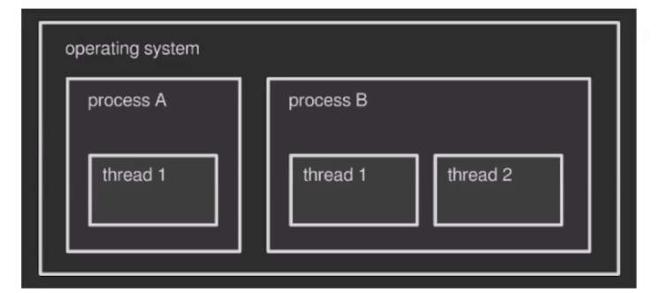
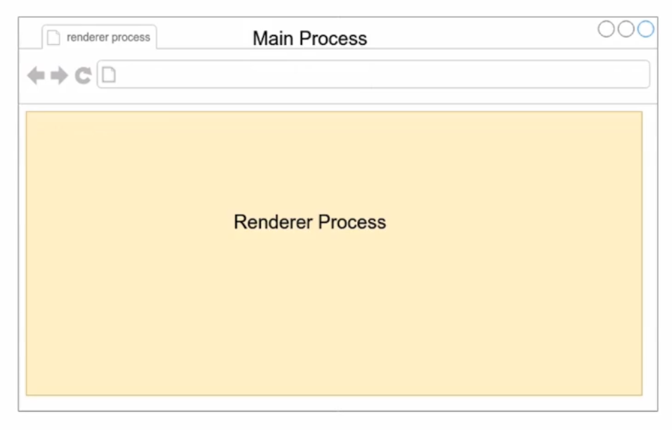
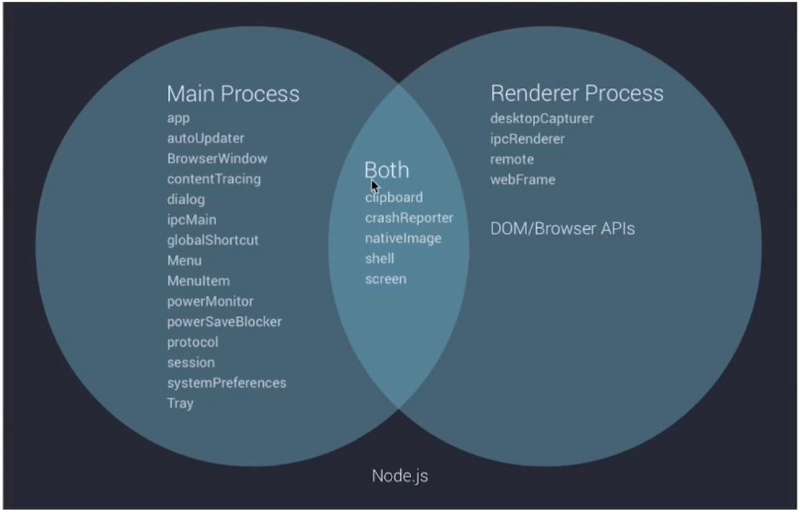
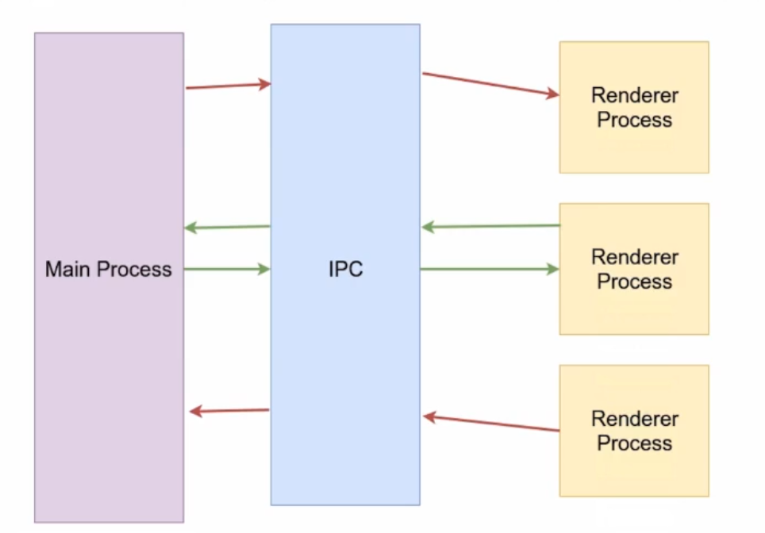
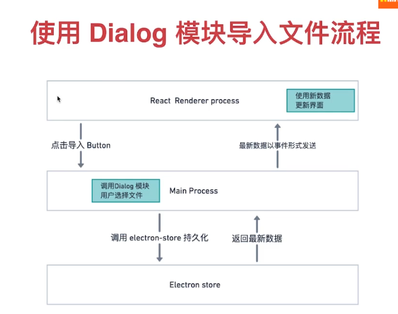

# Electron

官网文档地址： https://electronjs.org/ 

## 快速启动一个Electron应用程序。

```js
# 克隆示例项目的仓库
$ git clone https://github.com/electron/electron-quick-start

# 进入这个仓库
$ cd electron-quick-start

# 安装依赖并运行
$ npm install && npm start
```

什么是进程：每一个运行的程序可以看成一个进程。

什么是线程？

线程是操作系统能够进行运算调度的最小单位。它被包含在进程之中，是进程种中的实际运作单位。

一个进程可以包含多个线程。



进程和线程之间的区别：

1. 内存使用方面的区别。每一个进程，操作系统都会默认给分匹配一块单独的内存。默认情况下，一个进程的内存无法被另外一个进程所共享。而线程不是这样，一个进程中的多个线程之间的内存是共享的。
2. 通信机制方面的区别。默认情况下进程很难互通，可以通过高级的手段进行互通：IPC（ Inter-Process Communication，进程间通信 ），而线程之间交互就非常简单，它们使用同一块内存，通信起来方便快捷。
3. 量级方面的区别。线程比进程更轻量级，创建更快，使用的资源也更少。

进程、线程和Electron有什么关系么？

## Electron与进程和线程的关系

Electron: 主进程和渲染进程。



 Electron通过将[Chromium](https://www.chromium.org/Home)和[Node.js](https://nodejs.org/)合并到同一个运行时环境中，并将其打包为Mac，Windows和Linux系统下的应用来实现这一目的。 

### 主进程-Main Process

- 可以使用和系统对接的Electron API -创建菜单、上窜文件等待。
- 创建渲染进程-Renderer Process。
- 全面支持Node.js。
- 只有一个，作为整个程序的入口点。

### 渲染进程-Renderer Process

- 可以有多个，每个对应一个窗口。
- 每个都是一个单独的进程。
- 全面支持Node.js和DOM API。
- 可以使用一部分Electron提供的API。


主进程与渲染进程的区别：



程序中的main.js表示主进程，render.js表示渲染进程。


### 

下载nodemon,配置启动命令：

```js
"start": "nodemon --watch main.js --exec \"electron .\""
```


DOMContentLoaded与onload有什么区别？


## 进程之间的通信方式

- Electron 使用IPC（ Inter-Process Communication)在进程之间进行通信。

  

安装Devtron插件:

```bash
npm install --save-dev devtron
```

```js
require('devtron').install()
```

使用Devtron插件：

`main.js`

```js
const { app, BrowserWindow } = require('electron') 

app.on('ready',() => {
  require('devtron').install()
  let mainWindow = new BrowserWindow({
    width: 1600,
    height: 800,
    webPreferences: {
      nodeIntegration: true
    }
  })
  mainWindow.loadFile('index.html')
  mainWindow.webContents.openDevTools()
})
```


主进程和渲染进程之间的通信：

`render.js`

```js
const { ipcRenderer } = require('electron')
window.addEventListener('DOMContentLoaded',() => {
    document.getElementById('node-version').innerHTML = process.versions.node
    document.getElementById('send').addEventListener('click',()=>{
        //发送消息到主进程
        ipcRenderer.send('message','hello from renderer')
    })
    ipcRenderer.on('reply',(event, arg) => {
        document.getElementById('message').innerHTML = arg
    })
})
```

`main.js`

```js
const { app, BrowserWindow, ipcMain } = require('electron') 

app.on('ready',() => {
  require('devtron').install()
  let mainWindow = new BrowserWindow({
    width: 1600,
    height: 800,
    webPreferences: {
      nodeIntegration: true
    }
  })
  mainWindow.loadFile('index.html')
  mainWindow.webContents.openDevTools()
  //主进程和渲染进程通信 
  ipcMain.on('message',(event, arg) => {
    console.log(arg)
    // console.log(event)
    //直接把消息发送回去,发送消息到渲染进程
    event.reply('reply','hello from main process')
  })
})
```


### 使用remote模块实现跨进程访问

 [remote](https://electronjs.org/docs/api/remote#remoteprocess )

> 在渲染进程中使用主进程模块。

 `remote` 模块为渲染进程（web页面）和主进程通信（IPC）提供了一种简单方法。 

 在Electron中, GUI 相关的模块 (如 `dialog`、`menu` 等) 仅在主进程中可用, 在渲染进程中不可用。 为了在渲染进程中使用它们, `ipc` 模块是向主进程发送进程间消息所必需的。 使用 `remote` 模块, 你可以调用 main 进程对象的方法, 而不必显式发送进程间消息 。

 例如：从渲染进程创建浏览器窗口 ：

```js
const { BrowserWindow } = require('electron').remote
let win = new BrowserWindow({ width: 800, height: 600 })
win.loadURL('https://github.com')
```

 **注意:** 反过来（如果需要从主进程访问渲染进程），可以使用 [webContents. executeJavascript ](https://electronjs.org/docs/api/web-contents#contentsexecutejavascriptcode-usergesture)。 

**注意事项：** 因为安全原因，remote 模块能在以下几种情况下被禁用：

- [`BrowserWindow`](https://electronjs.org/docs/api/browser-window) - 通过设置 `enableRemoteModule` 选项为 `false`。
-  [`webview`](https://electronjs.org/docs/api/webview-tag) - 通过把 `enableremotemodule`属性设置成 `false`。 


### 持久化保存数据的方案

- 数据库软件的方案
- 浏览器相关的解决方案
- 使用Electron-strore保存数据




https://www.producthunt.com/