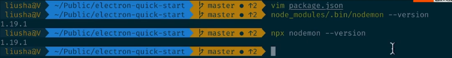

# React

React 特点

- 声明式语法
- 组件化
- 一次学习，随处编写

### 配置开发环境

npx是什么？（npm 5.2版本以上才有）

- 避免安装全局模块

- 调用项目内部安装的模块

- 

  

```bash
npx create-react-app react-hooks
```


## Hooks

### State Hook


```js
import React, { useState } from 'react'

const LikeButton = () => {
    // setLike是更新state的一种方法
    // const [ like, setLike ] = useState(0)
    const [obj, setObj ] = useState({like:0, on: true})
    return (
        <>
        <button onClick={()=>{setObj({like: obj.like+1,on: obj.on})}}>
            {obj.like}赞
        </button>

        <button onClick={()=>{setObj({like: obj.like,on:!obj.on})}}>
            { obj.on ? 'On' : 'off'}
        </button>
        </>
    )
}

export default LikeButton
```

`useEffect`在每次渲染之后都会执行么？

它会在第一次渲染和每次更新后，都会重新执行一下。


#### 需要清除的Effect(副作用)

```js
import React, { useState, useEffect } from 'react'

const MouseTracker = () => {
    const [ positions, setPositions ] = useState({x: 0, y: 0})
    useEffect(()=>{
        // document.addEventListener('click',(event)=>{
        //     // console.log('inner')  暴露出问题，如何做到每次使用之后清除掉这个事件，再添加呢？
        //     setPositions({x:event.clientX,y: event.clientY})
        // })

        const updateMouse = (event) => {
            console.log('inner')
            setPositions({
                x: event.clientX,
                y: event.clientY
            })
        }
        console.log('add listener')
        document.addEventListener('click',updateMouse)
        
        //组件卸载时进行清除副作用
        return () => {
            console.log('remove listener')
            document.removeEventListener('click',updateMouse)
        }
    })
    return (
    <p>X: {positions.x},Y:{positions.y}</p>
    )
}

export default MouseTracker
```


如何控制`useEffect`的调用次数? 


```js
import React, { useState, useEffect } from 'react'
import axios from 'axios'

const DogShow = () => {
    const [ url, setUrl ] = useState('')
    const [ loading, setLoading ]  = useState(false)
    const [ fetch, setFetch ] = useState(false)

    const style={
        width: 200
    }

    useEffect(() => {
        setLoading(true)
        axios.get('https://dog.ceo/api/breeds/image/random').then( result => { 
            setUrl(result.data.message)
            setLoading(false)
        })
    },[fetch])

    return (
        <>
            { 
                loading ? <p>读取中...</p>
                : 
            }
            <button onClick={()=>{setFetch(!fetch)}}>换一张</button>
        </>
    )
}

export default DogShow
```


## 自定义Hook

- 将组件逻辑提取到可重用的函数中
- 自定义hook必须以use开头

```js
import React, { useState, useEffect } from 'react'

const useMousePosition = () =>{
    const [ positions, setPositions ] = useState({x: 0, y: 0})
    useEffect(()=>{

        const updateMouse = (event) => {

            setPositions({
                x: event.clientX,
                y: event.clientY
            })
        }
        console.log('add listener')
        document.addEventListener('mousemove',updateMouse)

        //组件卸载时，清除副作用
        return () => {
            console.log('remove listener')
            document.removeEventListener('mousemove',updateMouse)
        }
    })
    return positions
}

export default useMousePosition
```

多个组件都调用了这个自定义hook，它们不会共享state,effect，是相互隔离的。


## HOC -Higher order Component

高阶组件就是一个函数，接受一个组件作为参数，返回一个新的组件。

可以完成异步数据的读取和展示。

推荐自定义Hook


自定义Hook

例子：

```js
import React, { useState, useEffect } from 'react'
import axios from 'axios'

const useURLLoader = (url) => {
    const [data, setData] = useState(null)
    const [loading, setLoading] = useState(false)
    useEffect(() => {
        setLoading(true)
        axios.get(url).then( result => { 
            console.log(result)
            setData(result.data)
            setLoading(false)
        })
    },[url])
    return [data, loading]
}

export default useURLLoader
```


Hook规则：

- 只在最顶层使用 Hook
- 只在React函数中使用Hook

[资料-Hooks用法]( https://usehooks.com/)


### Flatten State


Hash Map


- 解决数组冗余
- 数据处理更加方便

reduce方法

```js
array.reduce(function(total, currentValue, currentIndex, arr), initialValue)
```

参数详解：

- *function(total,currentValue, index,arr)*

必需。用于执行每个数组元素的函数。
函数参数:

| 参数           | 描述                                                  |
| :------------- | :---------------------------------------------------- |
| *total*        | 必需。*初始值*, 或者计算结束后的返回值。PreviousValue |
| *currentValue* | 必需。当前元素                                        |
| *currentIndex* | 可选。当前元素的索引                                  |
| *arr*          | 可选。当前元素所属的数组对象                          |

- initialValue

可选。传递给函数的初始值

`helper.js`

```js
// 扁平化数组
export const flattenArr = (arr) => {
  return arr.reduce((map, item) => {
    map[item.id] = item;
    return map;
  }, {});
}

// 还原数组
export const objToArr = (obj) => {
  return Object.keys(obj).map(key => obj[key]);
}
```


