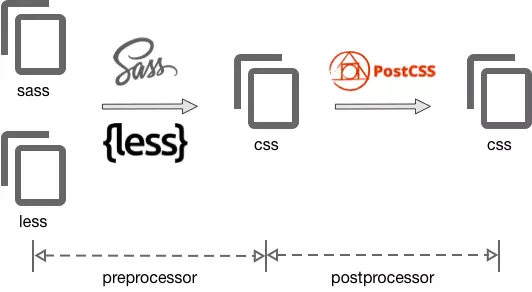

# PostCss

## 什么是postcss?

PostCSS 是一个允许使用 JS 插件转换样式的工具，类似babel对js的处理。

PostCSS 接收一个 CSS 文件并提供了一个 API 来分析、修改它的规则（通过把 CSS 规则转换成一个[抽象语法树](https://zh.wikipedia.org/wiki/抽象語法樹)的方式）。在这之后，这个 API 便可被许多[插件](https://github.com/postcss/postcss/blob/master/README-cn.md#插件)利用来做有用的事情，比如寻错或自动添加 CSS vendor 前缀。

常见的功能如下：

1. 使用下一代css语法。
2. 自动补全浏览器的前缀。
3. 自动将px转化成rem。
4. css代码压缩等等。

postcss只是一个工具，本身不会对css进行操作，它通过插件的形式实现功能。例如：自动增加前缀的工具[autoprefixer](https://github.com/postcss/autoprefixer)。

## 与less sass 的区别

less、sass 是预处理器，用来支持扩展css语法。

postcss既不是预处理器也不是后处理器，其功能应用比较广泛，而且它可以结合less、sass使用。



虽然可以结合 less/sass使用，但是它们还是有很多重复的功能。

## 预处理和后处理的区别：

为了简单的方式解释预处理和后处理的不同，这里以单位转换为例。当书写 Sass 时，我们可以用函数`px`转换成`rem`：

```css
/* input */
.selector { margin-bottom: rem(20px); }

/* output, assuming base font size is 1rem */
.selector { margin-bottom: 1.25rem; }
```


这种方式节省了我们手工计算的时间。不过通过 PostCSS，我们能够做的更好。因为是后处理的缘故，我们不需要任何函数来编译 CSS。我们可以直接书写`px`，它可以自动地转换成`rem`。

```css
/* input */
.selector { margin-bottom: 20px; }

/* output, assuming base font size is 1rem */
.selector { margin-bottom: 1.25rem; }
```

PostCSS 会在每一个`px`值出现并运行计算之前处理声明，将其转换成`rem`的值。


## 如何使用？

在webpack中集成使用，首先需要安装loader。

1. 安装：

```bash
npm install postcss-loader --save
```

2. webpack配置：

在 `webpack.config.js` 里使用 [`postcss-loader`](https://github.com/postcss/postcss-loader) :

```js
module.exports = {
  module: {
    rules: [
      {
        test: /\.css$/,
        exclude: /node_modules/,
        use: [
          {
            loader: 'style-loader',
          },
          {
            loader: 'css-loader',
            options: {
              importLoaders: 1,
            }
          },
          {
            loader: 'postcss-loader'
          }
        ]
      }
    ]
  }
}
```

然后创建 `postcss.config.js`:

```js
module.exports = {
  plugins: {
    'autoprefixer': {
        browsers: '> 5%' //可以都不填，用默认配置
    }
  }
}
```

注：也可以在webpack中配置。


## 常用的postcss插件

### autoprefixer

前缀补全，全自动的。

```bash
npm install autoprefixer --save-dev
```

### postcss-cssnext

使用下个版本的css语法，语法见**cssnext (css4)语法**

```bash
npm install postcss-cssnext --save-dev
```

cssnext包含了 autoprefixer ，都安装会报错，如下：

```js
Warning: postcss-cssnext found a duplicate plugin ('autoprefixer') in your postcss plugins. This might be inefficient. You should remove 'autoprefixer' from your postcss plugin list since it's already included by postcss-cssnext.
```


### postcss-pxtorem

[postcss-pxtorem](https://github.com/cuth/postcss-pxtorem):把px转换成rem。

```bash
npm install postcss-pxtorem --save-dev
```

配置项：


```js
{
    rootValue: 16, //你在html节点设的font-size大小
    unitPrecision: 5, //转rem精确到小数点多少位
    propList: ['font', 'font-size', 'line-height', 'letter-spacing'],//指定转换成rem的属性，支持 * ！
    selectorBlackList: [],// str/reg 指定不转换的选择器，str时包含字段即匹配
    replace: true,
    mediaQuery: false, //媒体查询内的px是否转换
    minPixelValue: 0 //小于指定数值的px不转换
}
```

在`postcss.config.js`中配置：

```js
module.exports = {
  plugins: {
    'autoprefixer': {
        browsers: '> 5%' //可以都不填，用默认配置
    },
     'precss',
      'postcss-pxtorem':{
          rootValue: 16, //你在html节点设的font-size大小
   		  unitPrecision: 5, //转rem精确到小数点多少位
    	  propList: ['font', 'font-size', 'line-height', 'letter-spacing'],//指定转换成rem的属性，支持 * ！
    	  selectorBlackList: [],// str/reg 指定不转换的选择器，str时包含字段即匹配
   		  replace: true,
    	  mediaQuery: false, //媒体查询内的px是否转换
    	  minPixelValue: 0 //小于指定数值的px不转换 
      }
  }
}
```


**特殊技巧:如何不转换成rem？**

px检测区分大小写，也就是说Px/PX/pX不会被转换，可以用这个方式避免转换成rem。


## vscode如何设置postcss-cssnext语法不报错

[思否解决方案](https://segmentfault.com/q/1010000012708394)


## 参考资料

[postcss中文翻译-github](https://github.com/postcss/postcss/blob/master/README-cn.md)

[postcss-pxtorem](https://github.com/cuth/postcss-pxtorem)

[postcss---介绍----翻译](https://www.cnblogs.com/wengxuesong/p/5454511.html)

[postcss---英文](https://www.sitepoint.com/an-introduction-to-postcss/?utm_source=sitepoint&utm_medium=relatedinline&utm_term=html-css&utm_campaign=relatedauthor)

[纠正PostCSS的4大认识误区---必看](https://www.cnblogs.com/wengxuesong/p/5466969.html)](https://www.cnblogs.com/wengxuesong/p/5466969.html)

[纠正postcss的4大误区](https://www.sitepoint.com/postcss-mythbusting/)