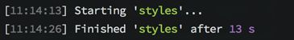
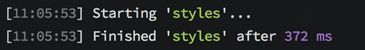

# cssnext

## cssnext 新特性：

**cssnext 包含了大量的新特性：**

- 自动提供浏览器前缀支持
- 自定义属性与 var() 支持
- 自定义属性集合与 @apply 支持
- 简化的、更安全的 calc()
- 可自定义的媒体查询
- 媒体查询范围
- 自定义选择器
- 嵌套
- image-set()
- color()
- hwb()
- gray()
- rrggbbaa 颜色
- rgba() 的降级方案
- rebeccapurple 颜色
- font-variant 属性
- filter 属性
- inital 值
- rem 单位的降级方案
- :any-link 伪类
- :mathces 伪类
- :not 伪类
- :: 伪元素语法的降级方案
- overflow-wrap 属性的降级方案
- 不区分大小写的属性
- 功能增强的 rga()
- 功能增强的 hsl()
- sysem-ui 字体


## 自动提供浏览器前缀支持：

自动添加（以及删除过时/没用的前缀），由 autoprefixer 实现


## 自定义属性与 var() 支持：

自定义属性的当前转换旨在提供一种限定在`:root`选择器中、面向未来的、由原生 CSS 自定义属性提供的新特性。

使用特性：

```css
:root {
  --mainColor: red;
}

a {
  color: var(--mainColor);
}
```

参考资料：

[Specification](http://www.w3.org/TR/css-variables/) | [Plugin documentation](https://github.com/postcss/postcss-custom-properties)

## 自定义属性集合与 @apply 支持：

允许你在已命名的自定义属性中存储一套变量，然后在其他类型规则中引用它。

```css
:root {
  --danger-theme: {
    color: white;
    background-color: red;
  };
}

.danger {
  @apply --danger-theme;
}
```

参考资料：

[Specification](https://tabatkins.github.io/specs/css-apply-rule) | [Plugin documentation](https://github.com/pascalduez/postcss-apply)


## 简化的、更安全的 calc()：

使用优化预分析 var() 引用来允许你更安全的用 calc() 使用自定义变量

```css
:root {
  --fontSize: 1rem;
}

h1 {
  font-size: calc(var(--fontSize) * 2);
}
```

参考资料：

[Specification](https://github.com/MoOx/reduce-css-calc#readme) | [Plugin documentation](https://github.com/postcss/postcss-calc)

## 可自定义的媒体查询

一个更好的方法来实现语义化的媒体查询

```css
@custom-media --small-viewport (max-width: 30em);
/* check out media queries ranges for a better syntax !*/

@media (--small-viewport) {
  /* styles for small viewport */
}
```

参考资料：

[Specification](https://drafts.csswg.org/mediaqueries-5/#custom-mq) | [Plugin documentation](https://github.com/postcss/postcss-custom-media)

## 媒体查询范围：

允许用 `<=` 和 `>=`来取代`min`和`max`

```css
@media (width >= 500px) and (width <= 1200px) {
  /* your styles */
}

/* or coupled with custom media queries */
@custom-media --only-medium-screen (width >= 500px) and (width <= 1200px);

@media (--only-medium-screen) {
  /* your styles */
}
```

参考资料：

[Specification](http://dev.w3.org/csswg/mediaqueries/#mq-ranges) | [Plugin documentation](https://github.com/postcss/postcss-media-minmax)


## 自定义选择器：

允许你创造自己的选择器

```css
@custom-selector :--button button, .button;

@custom-selector :--enter :hover, :focus;

:--button {
  /* styles for your buttons */
}

:--button:--enter {
  /*
   hover/focus styles for your button
   Read more about :enter proposal
   http://discourse.specifiction.org/t/a-common-pseudo-class-for-hover-and-focus/877
  */
}
```

参考资料：

[Specification](http://dev.w3.org/csswg/css-extensions/#custom-selectors) | [Plugin documentation](https://github.com/postcss/postcss-custom-selector)


## 嵌套：

允许你使用嵌套选择器

```css
a {
  /* direct nesting (& MUST be the first part of selector)*/
  & span {
    color: white;
  }

  /* @nest rule (for complex nesting) */
  @nest span & {
    color: blue;
  } 

  /* media query automatic nesting */
  @media (min-width: 30em) {
    color: yellow;
  }
}
```

```css
a, b {
  color: red;

  & c, & d {
    color: white;
  }
}

/* becomes */

a, b {
  color: red;
}

a c, a d, b c, b d {
  color: white;
}
```

参考资料：

[Specification](http://tabatkins.github.io/specs/css-nesting/) | [Plugin documentation](https://github.com/jonathantneal/postcss-nesting)


## image-set() 函数：

允许你根据不同的用户设备来提供不同的图片解决方案。

```css
.foo {
  background-image: image-set(url(img/test.png) 1x,
 url(img/test-2x.png) 2x,
 url(my-img-print.png) 600dpi);
}
```

参考资料：

[Specification](https://drafts.csswg.org/css-images-3/#image-set-notation) | [Plugin documentation](https://github.com/SuperOl3g/postcss-image-set-polyfill)


## color() 函数：

一个颜色函数来修改颜色。

```css
a {
  color: color(red alpha(-10%));
}

a:hover {
  color: color(red blackness(80%));
}
```


```css
color( [ <color> | <hue> ] <color-adjuster>* )
```

Using this `input.css`:

```css
body {
  background: color(red a(90%))
}
```

you will get:

```css
body {
  background: rgba(255, 0, 0, 0.9)
}
```

参考资料：

[Specification](http://dev.w3.org/csswg/css-color/#modifying-colors) | [Plugin documentation](https://github.com/postcss/postcss-color-function)


## hwb() 函数

与 hs1() 相似，不过更容易阅读。

```css
body {
  color: hwb(90, 0%, 0%, 0.5);
}
```

参考资料：

[Specification](http://dev.w3.org/csswg/css-color/#the-hwb-notation) | [Plugin documentation](https://github.com/postcss/postcss-color-hwb)

## gray() 函数：

允许你使用超过50种渐变的灰度值，对于第一个参数，你可以使用 0 - 255 的数值或者百分比。

```css
.foo {
  color: gray(85);
}

.bar {
  color: gray(10%, 50%);
}
```


## rrggbbaa 颜色值：

允许使用4位或者8位十六进制数来表示颜色

```css
body {
  background: #9d9c;
}
```

[Specification](http://www.w3.org/TR/css3-color/) | [Plugin documentation](https://github.com/postcss/postcss-color-rgba-fallback)

## rgba() 的降级方案：

如果你使用的是旧的浏览器（比如 IE8），那么把 rgba() 转换为实体颜色

```css
body {
  background: rgba(153, 221, 153, 0.8);
  /* you will have the same value without alpha as a fallback */
}
```

[Specification](http://dev.w3.org/csswg/css-color/#valdef-color-rebeccapurple) | [Plugin documentation](https://github.com/postcss/postcss-color-rebeccapurple)

## rebeccapurple 颜色：

允许你使用新的颜色关键词。

```css
body {
  color: rebeccapurple;
}
```

you will get:

```css
body {
  color: rgb(102, 51, 153);
}
```

[color-name](https://drafts.csswg.org/css-color/#valdef-color-rebeccapurple)

参考资料：

[Specification](http://dev.w3.org/csswg/css-color/#valdef-color-rebeccapurple) | [Plugin documentation](https://github.com/postcss/postcss-color-rebeccapurple)

## font-variant 属性：

通过 `font-feature-settings`降级的一种属性。你可以通过这个链接来查看浏览器支持。 [font feature settings](http://caniuse.com/#feat=font-feature)

```css
h2 {
  font-variant-caps: small-caps;
}

table {
  font-variant-numeric: lining-nums;
}
```

you will get:

```css
h2 {
  font-feature-settings: "c2sc";
  font-variant-caps: small-caps;
}

table {
  font-feature-settings: "lnum";
  font-variant-numeric: lining-nums;
}
```


参考资料：

[Specification](http://dev.w3.org/csswg/css-fonts/#propdef-font-variant) | [Plugin documentation](https://github.com/postcss/postcss-font-variant)


## filter 属性：

W3C 的 filters 只允许使用`url(data:*)`来转换 svg filter。

```css
.blur {
  filter: blur(4px);
}
```

[Specification](http://www.w3.org/TR/filter-effects/) | [Plugin documentation](https://github.com/iamvdo/pleeease-filters)


## inital 值：

允许你使用如何值的初始值。该值表示属性初始化值所指定的值，但这并不意味着浏览器的默认值。

比如，对于`display`属性，initial 时钟标示内联，因为这是属性指定的初始值。一个例子，`div { display: initial }`并不代表`block`，而是`inline`。

```css
div {
  display: initial; /* inline */
}
```


## rem 单位：

在旧浏览器里将 rem 降级为 px（比如IE8）

```css
h1 {
  font-size: 1.5rem;
}
```

参考资料：

[Specification](http://www.w3.org/TR/css3-values/#rem-unit) | [Plugin documentation](https://github.com/robwierzbowski/node-pixrem)


## :any-link 伪类：

允许你使用`:any-link`伪类

```css
nav :any-link > span {
  background-color: yellow;
}

/* becomes */

nav :link > span, nav :visited > span {
  background-color: yellow;
}
```

参考资料：

[Specification](http://dev.w3.org/csswg/selectors/#any-link-pseudo) | [Plugin documentation](https://github.com/jonathantneal/postcss-pseudo-class-any-link)

## :matches 伪类：

允许你使用`:matches`伪类。

Using this `input.css`:

```css
p:matches(:first-child, .special) {
  color: red;
}
```

you will get:

```css
p:first-child, p.special {
  color: red;
}
```


参考资料：

[Specification](http://dev.w3.org/csswg/selectors-4/#matches) | [Plugin documentation](https://github.com/postcss/postcss-selector-matches)

## :not 伪类：

允许你使用支持最多选择器的`:not`伪类，将此降级为只选择一个选择器的`:not`。


Using this `input.css`:

```css
p:not(:first-child, .special) {
  color: red;
}
```

you will get:

```css
p:not(:first-child):not(.special) {
  color: red;
}
```

参考资料：

[Specification](http://dev.w3.org/csswg/selectors-4/#negation) | [Plugin documentation](https://github.com/postcss/postcss-selector-NOT)


## :: 伪元素语法降级：

如果你的浏览器是旧浏览器，会将 :: 降级为 :。

```css
a::before {
  /* ... */
}
```


[Specification](http://www.w3.org/TR/css3-selectors/#pseudo-elements) | [Plugin documentation](https://github.com/axa-ch/postcss-pseudoelements)

## overflow-wrap 属性：

将`overflow-wrap`转换为`word-wrap`属性

```css
body {
  overflow-wrap: break-word;
}
```

```css
/* before */
.foo {
    overflow-wrap: break-word;
}

/* after */
.foo {
    word-wrap: break-word;
}
```

配置文件中进行配置`{ method: 'copy' }`后：

```css
/* before, when the option { method: 'copy' } is passed */
.foo {
    overflow-wrap: break-word;
}

/* after */
.foo {
    word-wrap: break-word;
    overflow-wrap: break-word;
}
```

参考资料：

[Specification](https://drafts.csswg.org/css-text-3/#propdef-word-wrap) | [Plugin documentation](https://github.com/MattDiMu/postcss-replace-overflow-wrap)


## 不区分大小写的属性：

允许你使用不区分大小写的属性

```css
[frame=hsides i] {
  border-style: solid none;
}
```

Output:

```css
[frame=hsides],[frame=Hsides],[frame=hSides],[frame=HSides],[frame=hsIdes],[frame=HsIdes],[frame=hSIdes],[frame=HSIdes],[frame=hsiDes],[frame=HsiDes],[frame=hSiDes],[frame=HSiDes],[frame=hsIDes],[frame=HsIDes],[frame=hSIDes],[frame=HSIDes],[frame=hsidEs],[frame=HsidEs],[frame=hSidEs],[frame=HSidEs],[frame=hsIdEs],[frame=HsIdEs],[frame=hSIdEs],[frame=HSIdEs],[frame=hsiDEs],[frame=HsiDEs],[frame=hSiDEs],[frame=HSiDEs],[frame=hsIDEs],[frame=HsIDEs],[frame=hSIDEs],[frame=HSIDEs],[frame=hsideS],[frame=HsideS],[frame=hSideS],[frame=HSideS],[frame=hsIdeS],[frame=HsIdeS],[frame=hSIdeS],[frame=HSIdeS],[frame=hsiDeS],[frame=HsiDeS],[frame=hSiDeS],[frame=HSiDeS],[frame=hsIDeS],[frame=HsIDeS],[frame=hSIDeS],[frame=HSIDeS],[frame=hsidES],[frame=HsidES],[frame=hSidES],[frame=HSidES],[frame=hsIdES],[frame=HsIdES],[frame=hSIdES],[frame=HSIdES],[frame=hsiDES],[frame=HsiDES],[frame=hSiDES],[frame=HSiDES],[frame=hsIDES],[frame=HsIDES],[frame=hSIDES],[frame=HSIDES] { border-style: solid none; }
```

[Specification](https://www.w3.org/TR/selectors4/#attribute-case) | [Plugin documentation](https://github.com/Semigradsky/postcss-attribute-case-insensitive)


## 功能增强的 rga()：

允许你使用由空格分割的参数与可选的由斜线分割的不透明度新语法。

你也可以使用数字来表示颜色通道。

alpha 值接受百分比和数字，并且将 rgb() 作为可选参数。因此 rgb() 和 rgba() 现在是彼此的别名。

```css
.foo {
  /* Input example */
  color: rgb(250.5 255 255);
  background-image: linear-gradient(to bottom right, rgb(10% 11% 12% / 90%), rgb(23% 24% 25% / .5));
}
```

```css
.foo {
  /* Output example */
  color: rgb(251, 255, 255);
  background-image: linear-gradient(to bottom right, rgba(10%, 11%, 12%, .9), rgba(23%, 24%, 25%, .5));
}
```

[Specification](https://drafts.csswg.org/css-color/#rgb-functions) | [Plugin documentation](https://github.com/dmarchena/postcss-color-rgb)


## 功能增强的 hs1()：

允许你使用由空格分割的参数与可选的由斜线分割的不透明度新语法。

hsl() 现在接受角度（deg, grad, rad, turn）以及用数字表示色调，用百分比或者数字来表示 alpha 值。所以 hsl() 与 hsla() 现在也是彼此的别名。

```css
div {
  color: hsl(90deg 90% 70%);
  background-color: hsl(300grad 25% 15% / 70%);
}
```

[Specification](https://drafts.csswg.org/css-color/#the-hsl-notation) | [Plugin documentation](https://github.com/dmarchena/postcss-color-hsl)


## system-ui 字体：

允许你使用 system-ui 通用字体系列。当前转换提供了一个实际的字体列表来作为降级方案。

```css
body {
  font-family: system-ui;
}
```

[Specification](https://drafts.csswg.org/css-fonts-4/#valdef-font-family-system-ui) | [Plugin documentation](https://github.com/JLHwung/postcss-font-family-system-ui)

<hr/>

## 使用 cssnext 书写未来的 CSS

cssnext 是一个 PostCSS 的包，我们可以在样式表中利用 cssnext 额外增加一些 CSS 规范。

```css
/* custom properties */
:root {
  --heading-color: #ff0000;
}

/* custom selectors 自定义选择器*/
@custom-selector :--headings h1, h2, h3, h4, h5, h6;

/* usage */
:--headings {
  color: var(--heading-color);
}
```

通过 cssnext，上述代码会被处理成以下内容

```css
h1,
h2,
h3,
h4,
h5,
h6 {
  color: #ff0000;
}
```

这真的很简洁，其中还有很多令人兴奋的特性。因为我们书写的是未来规范的 CSS，所以 PostCSS 的生成步骤不需要浏览器去执行。

------

## 用自定义函数扩展 CSS 的功能：

使用 cssnext，我们可以通过 javascript 创建自定义函数来操作被解析的 CSS。在 Sass 中，我们经常使用生成行距的函数（根据基本的 line-height 计算），它有助于创建简单且可维护的垂直韵律。

```css
$line-height: 32px;

/* vertical rhythm function */
@function vr($amount) {
  @return $line-height * $amount;
}

/* input */
.selector { margin-bottom: vr(2) }

/* output */
.selector { margin-bottom: 64px; }
```

如果用 PostCSS 做的话，我们可以自定义 CSS 组件而不是函数。

```css
/* input */
.selector { margin-bottom: 2vr }

/* output */
.selector { margin-bottom: 64px; }
```

------

## 执行速度：

PostCSS 声称比预处理器快 3-30 倍。这里使用 10000 个选择器的 5 个属性上使用上述 Sass 函数和 PostCSS 函数，也就是处理 50000 次，以下是对比结果。

Libsass 3.2



PostCSS




从结果中很显然看出，PostCSS 比 LibSass 的速度快了很多。


## 参考资料

[cssnext--github](https://cssnext.github.io/)

[cssnext---掘金](https://zhuanlan.zhihu.com/p/37856721)

[cssnext中文翻译---思否](https://www.codesky.me/archives/postcss-cssnext-css-features.wind)

