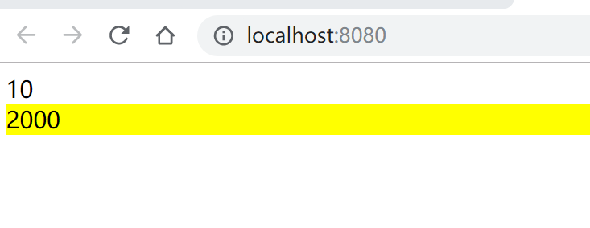
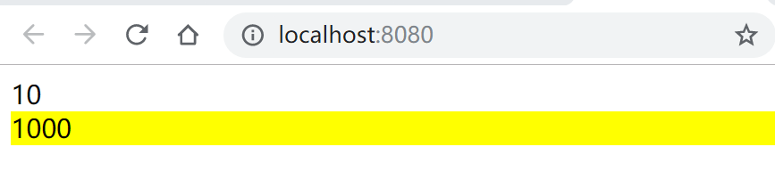

# 徐小杨工作日报

| 作者   | 日期       |
| ------ | ---------- |
| 徐小杨 | 2019.10.10 |

[TOC]

## 一、工作任务完成情况
### AnyShare任务需求
熟悉图片摘要演示功能。

下一步： 进行逻辑设计。


### 学习任务
- 学习Hot Module Replacement。

## 二、学习心得
### Hot Module Replacement(模块热替换)


  简称： HMR

   它允许在运行时更新各种模块，而无需进行完全刷新。

   `webpack.config.js`

```js
   const HtmlWebpackPlugin = require('html-webpack-plugin');
   const path = require('path')
   const webpack = require('webpack')
   
   module.exports = {
       //入口文件
       entry:{
            main:'./src/index.js'
       },
       devServer:{
         //指定根路径
         contentBase: '/dist',
         //在启动webpck-dever-sever时，会自动的打开浏览器
         open: true,
         //开启hot module Replacement
         hot: true,
         //html失效时，不需要重新刷新页面
         hotOnly: true
       },
       plugins:[
         new HtmlWebpackPlugin({
         template:'src/index.html'
         }),
         new webpack.HotModuleReplacementPlugin()
     ],
       output:{
           publicPath: '/',
           //打包后的文件名
           filename: 'bundle.js',
           //指定存为位置
           path: path.resolve(__dirname,'dist')
       },
       module: {
         rules: [
           {
             test: /\.css$/,
             use: [
               {
                 loader:'style-loader',
               },
               {
                 loader: 'css-loader',
                 options: {
                   importLoaders: 1,
                   modules: true //开启模块化打包
                 }
               },
              {
                loader:'postcss-loader'
              }  
             ]
           }
         ]
       }
     }
```

#### 作用：

**如果一个模块发生了变化，而另一个模块没有发生变化，那么当只想更新变化的模块，怎么做呢？**

例子：

首先创建两个引用函数（模块）：

`counter.js`它可以在页面通过点击按钮实现数字++功能。

```js
function counter() {
    let div = document.createElement('div')
    div.innerHTML = 1
    div.setAttribute('id','counter')

    div.onclick = function() {
        div.innerHTML = parseInt(div.innerHTML,10) +1
    }
    document.body.appendChild(div)
}

export default counter
```

`number.js`

```js
function number() {
    let div = document.createElement('div')
    div.setAttribute('id','number')
    div.innerHTML = 2000
    document.body.appendChild(div)
}

export default number;
```


入口文件`index.js`引入`number.js`和`counter.js`

`index.js`

```js
import number from './number'
import counter from './counter'

counter()
number()

//如果一个模块发生了变化，而另一个模块没有发生变化，那么只想更新变化的模块，怎么做呢？
if(module.hot) {
    //监控模块的变化
    module.hot.accept('./number',()=>{
        document.body.removeChild( document.getElementById('number'))
        number()
    })
}
```

当在页面进行点击按钮进行加加功能时（counter.js），从1加到一个固定的数字10，如下页面。



当在代码中的`number.js`（模块）的数字发生改变（如：手动改成1000）时，页面中应该也相应的发生变化

变成1000，但是页面中的模块`counter.js`不应该重置为1，而是保持10这个数字。通过` module.hot.accept`可以实现如上所述功能。呈现效果图如下：




css的改变也应该实现如上类似的功能，当css代码部分发生改变时，只更新css改变对应部分的模块，而其他模块不应该发生改变。这该如何实现呢？

其实`css-loader`已经帮助我们实现了上述的功能，不需要我们自己再通过` module.hot.accept`的方式再去实现。（注意：通过webpackDevServer运行的服务器下打包压缩的文件是存放在电脑内存里的，它不会生成dist目录，用postcss-cssnext语法写的css因为需要webpack打包，这种情况需要刷新页面才能有效果。）


## 三、参考资料
- [Hot Module Replacement]([https://www.webpackjs.com/guides/hot-module-replacement/#hmr-%E4%BF%AE%E6%94%B9%E6%A0%B7%E5%BC%8F%E8%A1%A8](https://www.webpackjs.com/guides/hot-module-replacement/#hmr-修改样式表))

