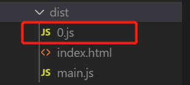

# 徐小杨工作日报

| 作者   | 日期       |
| ------ | ---------- |
| 徐小杨 | 2019.10.16 |

[TOC]

## 一、工作任务完成情况

### 工作任务

​	 熟悉隐藏外链共享页面邮件发送链接的需求 ，完成STMP配置，发送测试邮件到企业邮箱。

​	遇到的问题：由于之前是克隆的虚拟机，导致在控制台部分点击应用管理跳转的时候，跳转到克隆对象机子的ip，还有外链共享的链接地址也是克隆对象的ip,这显然是不可以的。

​	解决方式：重新激活集群来对ip进行重置并配置自己当前机子的ip，从而使得该问题得以解决。

下一步：对隐藏外链共享页面邮件发送链接的需求进行逻辑分析。

### 学习任务

- 学习Code Splitting

## 二、学习心得

### Webpack和 Code Splitting

举例子说明Code Splitiing。

安装loadsh

```bash
npm install loadsh --save

yarn add loadsh
```

index.js

```js
import _ from "loadsh" //1MB

//业务逻辑 1mb
console.log(_.join(['a','b','c'],'***'))

//此处省略1万行代码
console.log(_.join(['a','b','c'],'***'))

//main.js 2mb 打包的文件

//打包文件会很大，加载时间会长

//main.js 2mb

//重新访问页面时，又要加载2mb的内容
```

当打包文件的很大时，访问页面的加载时间会很长

当重新访问页面时，又要加载2mb的内容，访问时间仍然很长。

那么如何解决这种问题呢？


#### 第一种方式

`loadsh.js`

```js
import _ from "loadsh" //1MB

window._ = _
```

index.js

```js
//业务逻辑 1mb
console.log(_.join(['a','b','c'],'***'))

//此处省略1万行代码
console.log(_.join(['a','b','c'],'***'))
```

通过做代码的分割来解决。使得main.js被拆成loadsh.js(1mb),main.js(1mb)。

当页面业务逻辑发生变化时，只要加载main.js即可。（1mb）

对`webpack.config.js`不同的入口文件做打包进行代码的分割。

```js
   entry:{
        loadsh:'./src/loadsh.js',
        main:'./src/index.js',
   },
```

这种方式可以在第二次加载时，只是在main.js业务逻辑变化，重新加载，而loadsh.js未修改，就不会重新加载。

===>这种代码的拆分就是Code Spliting,这种方式是我们自己动手做拆分。

#### 第二种方式

那么如何智能的做代码的拆分呢？

通过 [`SplitChunksPlugin`](https://webpack.js.org/plugins/split-chunks-plugin/) 来做Code Splitting

```js
//做代码分割。
   optimization: {
     splitChunks: {
       chunks: 'all',
     },
  },
```

打包后dist文件夹的目录如下（红色部分为新增的）：


这里红色标记的框是对loadsh的代码进行了打包，通过这种方式webpack自动的对代码进行分割。


#### 第三种方式

还可以通过其他的方式进行代码的分割（无需做配置）。方法如下：

例子：

`index.js`

```js
function getComponent() {
    return import('loadsh').then(({default:_})=>{
        let element =document.createElement('div')

        element.innerHTML = _.join(['Dell','lee','-'])

        return element
    })
}

getComponent().then(el => {
    document.body.appendChild(el)
})
```

打包结果：



loadsh模块的代码被打包成了0.js，这是因为webpack会自动的对这种异步的代码进行代码分割。这种方式不需要做任何其他的配置。

## 三、参考资料

- [Code Splitting]( https://webpack.js.org/guides/code-splitting/ )

