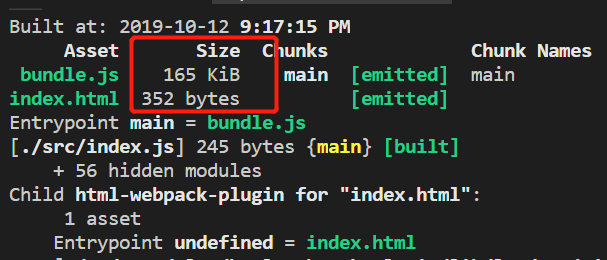

# 徐小杨工作日报

| 作者   | 日期       |
| ------ | ---------- |
| 徐小杨 | 2019.10.12 |

[TOC]

## 一、工作任务完成情况
### 工作任务

​	完成统一文档库替换代码到环境进行自测，以及ShareWebClient的小包构建。

下一步： 继续构建大包，将其替换到环境上再次自测，功能无误后通知测试进行测试。

​				继续完善图片摘要演示功能的逻辑设计。


### 学习任务
- 学习webpack中的babel配置。

## 二、学习心得
### babel配置

使用Babel处理ES6语法。

#### webpack的方式

```js
npm install --save-dev babel-loader @babel/core
```

babel-loader:帮助webpack做打包的一个工具。

babel/core：是babel的一个核心库，能够让babel识别js中的内容，然后把这个js代码转化

成ast抽象语法树，再将ast抽象语法树编译转化成新的语法出来。只要知道babel/core是babel的一个核心库就行。

`webpack.config.js`做配置

```js
module: {
  rules: [
    { 
        test: /\.js$/, 
    	//node_modules实际是第三发代码，没必要对其进行babel转化，将其排除在外。    
        exclude: /node_modules/, 
        loader: "babel-loader" 
    }
  ]
}
```

babel-loader只是webpack与balbe做通信的桥梁，实际上并不会帮助你对js代码里面的ES6语法翻译成ES5的语法，还需要其他的模块对其进行翻译，这里需要@babel/preset-env模块。

```bash
npm install @babel/preset-env --save-dev
```

@babel/preset-env包含了所有ES6翻译成ES5的翻译规则。

然后对`webpack.config.js`添加optios

```js
module: {
  rules: [
    { 
        test: /\.js$/, 
    	//node_modules实际是第三发代码，没必要对其进行babel转化，将其排除在外。    
        exclude: /node_modules/, 
        loader: "babel-loader",
        options: {
            "presets": ["@babel/preset-env"]
        }
    }
  ]
}
```

通过以上的方式可以对其进行了翻译，但是对于一些低版本的浏览器里还是不支持一部分语法，列入Promise,map这些没被翻译。还需要对这一部分缺失的翻译补充进去，这是需要@babel/polyfill这个模块来进行补充。

```bash
npm install --save @babel/polyfill

yarn add @babel/polyfill
```

这时只需要在所有代码运行之前引入就可以解决：

```js
require("@babel/polyfill");
或者：
import "@babel/polyfill";
```

在未引入`@babel/polyfill`,运行`yarn build`命令进行打包：


在引入`@babel/polyfill`之后，运行`yarn build`命令进行打包后：


引入`@babel/polyfill`之后发现打包的文件大小变大了，这是因为它需要弥补低版本浏览器不存在的内容，它对所有未使用的语法也进行了实现，这显然不是我们想要的结果，我们这想对我们引入使用的语法做实现即可。如何实现呢？对@babel/preset-env做配置:将"useBuiltIns"设置为"usage"。

```js
     { 
          test: /\.js$/, 
          //node_modules实际是第三发代码，没必要对其进行babel转化，将其排除在外。
          exclude: /node_modules/,
           loader: "babel-loader" ,
           options: {
             "presets": [
               ["@babel/preset-env",{
                "useBuiltIns": "usage"
             }]
            ]
           }
        }
```

然后再运行打包`yarn build`：



这时大小就会精简了很多。

还可以通过指定浏览器版本(因为我们有时候不需要对其他低版本浏览器做兼容，这时可以通过这种方式来解决):

```js
   { 
          test: /\.js$/, 
          //node_modules实际是第三发代码，没必要对其进行babel转化，将其排除在外。
          exclude: /node_modules/,
           loader: "babel-loader" ,
           options: {
             "presets": [
               ["@babel/preset-env",
                {
                  "targets": {
                    "chrome": "67"                 
                  },             
                "useBuiltIns": "usage"
              }
              ]
            ]
           }
    }
```

通过打包后：


## 三、参考资料
- [资料](https://babel.docschina.org/setup#installation)