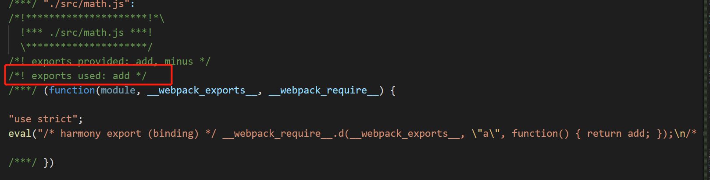

# 徐小杨工作日报

| 作者   | 日期       |
| ------ | ---------- |
| 徐小杨 | 2019.10.14 |

[TOC]

## 一、工作任务完成情况

### 工作任务

​	完成分支需求的大包构建并替换到环境上进行了自测，并通知测试进行通道。

下一步：等待进行通道测试。

### 学习任务

- 学习webpack中的Tree shaking。

## 二、学习心得

### Tree Shaking

举例说明Tree Shaking的作用。

资料：[Tree shaking](https://webpack.js.org/guides/tree-shaking/#root)

`math.js`

```js
export const add = (a,b) => {
    console.log(a+b)
}

export const minus = (a,b) => {
    console.log(a-b)
}
```

`index.js`

```js
import { add } from './math'

add(1,2)
```

运行`yarn build`打包后生成bundle.js,webpack打包将math.js中的add、minus方法都进行了打包，但是我们只在index.js中引入了add方法，最理想的是只对引入的add方法进行打包，而未使用的其他方法或模块应该不被打包进去。


那么如何实现这种理想状态呢？

通过`Tree Shaking`来解决。一个模块可以理解成一个树，这个模块可以导出很多内容，这些内容可以理解成一个小的树形结构。当只引入树的一部分，而只对引入的部分做打包，未引入的部分不做打包处理（不引入的部分剔除掉，摇晃掉）。

#### 如何实现Tree Shaking

当mode为development的模式时，默认是没有`Tree Shaking`这个功能。

在webpack.config.js中配置:

```js
 optimization: {
      usedExports: true
  }
```

接着在package.json中配置：

```js
{
  "name": "demo06",
  "sideEffects": false,
}
```

`sideEffects`的作用是对某个引入的文件或模块不做`Tree Shaking`处理。当设置为false时是没有不做`Tree Shaking`处理的代码。

```js
//举例子：
{
  "name": "demo06",
  //此时`Tree Shaking`对@babel/polly-fill没有作用。
  "sideEffects": ["@babel/polly-fill"],
}
```

一般不对css文件做`Tree Shaking`。

```js
//举例子：
{
  "name": "demo06",
  //此时`Tree Shaking`对css文件没有作用。
  "sideEffects": [
      "*.css"
  ],
}
```

做了以上处理后，再执行打包的命令`yarn build`：



这时仍然对未引入的模块进行了打包处理，但是此时webpack已经知道只对add模块做了引入使用（如上图红框标记）。这时是因为此时的mode为`development`（开发模式），这是为了我们在做开发时方便调试，防止了source-map工具的映射出错，所以会保留未引入模块的代码。

当把mode改为`production`模式，打包上线的情况（生产环境）。

当mode为`production`时，其实这个模式下，`Tree Shaking`的配置其实已经自动的写好了，不需要再做上面的配置，但是`sideEffects`仍然需要写一下。

执行压缩打包命令`yarn build`后：


这时minus方法就没有引入了，就只是对引入使用的add方法做了打包处理。


## 三、参考资料

- [Tree shaking](https://webpack.js.org/guides/tree-shaking/#root)