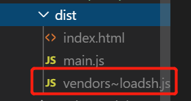
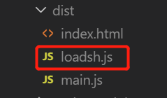

# 徐小杨工作日报

| 作者   | 日期       |
| ------ | ---------- |
| 徐小杨 | 2019.10.17 |

[TOC]

## 一、工作任务完成情况

### 工作任务

对隐藏外链邮件发送链接进行逻辑分析。

参加图片摘要的会议。

下一步：继续对隐藏外链共享页面邮件发送链接的需求进行逻辑分析。

### 学习任务

- 学习SplitChunksPlugin 配置参数详解

## 二、学习心得

### SplitChunksPlugin 配置参数详解

#### 安装魔法注释

通过这个注释可以更好的我们的打包文件重命名.

```bash
npm install --save-dev @babel/plugin-syntax-dynamic-import

yarn add @babel/plugin-syntax-dynamic-import --dev
```

`.babelrc`

```js
{
    "presets": [
        [
            "@babel/preset-env",{
             "targets": {
             "chrome": "67"           
            },             
            },
        ],
        
        "@babel/preset-react"
     ],
     "plugins": ["@babel/plugin-syntax-dynamic-import"]
}
```


`index.js`

```js
function getComponent() {
    //魔法注释,对打包的文件的名字命名为loadsh
    return import(/*webpackChunkName:"loadsh"*/'loadsh').then(({default:_})=>{
        let element =document.createElement('div')

        element.innerHTML = _.join(['Dell','lee','-'])

        return element
    })
}

getComponent().then(el => {
    document.body.appendChild(el)
})
```

运行`yarn dev-build`后：



0.js的loadsh打包文件重命名为红色框的名字。

如果想要打包的文件为`loadsh`则可以做如下配置:

`webpack.config.js`

```js
 optimization: {
     splitChunks: {
       chunks: 'all',
       cacheGroups: {   
          vendors:false,
          default: false
      }
     },
  },
```

这时候再运行打包的命令后:



#### 配置参数说明

做代码分割的参数说明(optimization中splitChunks里面的参数):

```js
//做代码分割。
   optimization: { 
     splitChunks: {
       //做代码分割时只对异步代码生效
      chunks: "all",

      //引入的库的大小大于30000字节(30kb)时,就做代码的分割,如果不大于就不做代码分割.
      // minSize: 30000,
      minSize: 0, //当 default: false时，不会生成打包的文件，这是因为打包的文件存放位置不知道放哪儿，所以不会生成。当不为false且default中的minChunks小于2时，就会对引入模块进行打包放在default~main.js中
      
      //当一个模块被引入的次数大于1，就做代码分割，否则不做代码分割
      minChunks: 1,

      //一个页面同时只能加载五个模块数，超过五个就不做代码的分割了
      maxAsyncRequests: 5,

      //整个网站首页（入口文件）进行加载的时候，引入的库最多只能做3个分割的js文件。
      maxInitialRequests: 3,

      //默认未定义名字时，对cacheGroups组下的组名加上~的分割符+入口文件名.js
      automaticNameDelimiter: '~',
      //使得下面组的自定义名字有效
      name: true,
      //缓存组，对同步的代码做代码分割（可以针对不同的规则来打包相应进组里）
      cacheGroups: {
         //vendors组
        vendors: {
          //检测引入的库是否是在node_modules下，如果是就符合vendors的要求，默认打包后生成的文件就以vodors~开头的文件（vendors~main）。
          test: /[\\/]node_modules[\\/]/,
          // 打包的内容放那个组下的优先级，值越大优先级越高。这里vendors组优先级大于default组。
          priority: -10,
          //也可以对符合要求的模块代码打包的名字自定义
          filename: 'vendors.js'
        },

        //当 default: false时，不会生成打包的文件，这是因为打包的文件存放位置不知道放哪儿，所以不会生成。当不为false且default中的minChunks小于2时，就会对引入模块进行打包放在default~main.js中
        default: {
          minChunks: 1,
          priority: -20,
          //它会判断之前打包模块时会判断之前是否打包过，如果已经被打包过，则忽略这个模块。如果没有打包过，就对该模块进行打包处理。
          reuseExistingChunk: true,
          //自定义打包后的打包文件名称
          filename: 'common.js'
        }
      }
    }
  }
```

## 三、参考资料

- [split-chunks-plugin]( https://www.webpackjs.com/plugins/split-chunks-plugin/ )

