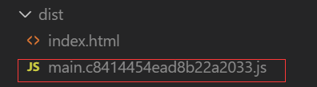

# 徐小杨工作日报

| 作者   | 日期       |
| ------ | ---------- |
| 徐小杨 | 2019.10.22 |

[TOC]

## 一、工作任务完成情况

### 工作任务

今天主要是对隐藏外链共享页面的邮件发送链接窗口进行逻辑分析，原本是打算在不增加接口的情况下通过发送邮件的接口返回errcode信息来获取到STMP服务器的配置信息，发现发送邮件的接口需要给后端传入一个mailto的必须参数，这显然就适合进行获取了，因此需要后端增减一个接口来返回STMP服务器的配置信息。

### 学习任务

- 学习webpack与浏览器缓存。

## 二、学习心得

### webpack与浏览器缓存

`index.js`

```js
import _ from 'loadsh'
import $ from 'jquery'

const dom = $('<div>')
dom.html(_.join(['xu','xx'],' '))
$('body').append(dom)
```

在`webpack.prod.js`中做如下配置：

```js
output:{
        //打包后的文件名
        filename: '[name].[contenthash].js',
        chunkFilename:'[name].[contenthash].js',
        //指定存为位置   
}
```

执行打包后：


首先假设已经将此时打包好的文件放在了服务器上。

这里以是否修改index.js的内容为例子：

1. 未对文件做修改时：

如果未做修改时，重新进行打包的文件名字hash值保持不变，这时候浏览器会利用它的缓存技术，保持页面不变。（文件名未发生变化，就会用在浏览器中已经缓存好的文件，不会重新加载页面）

第二次打包后：




2. 修改文件内容时：

   index.js内容做修改后：

```js
import _ from 'loadsh'
import $ from 'jquery'

const dom = $('<div>')
dom.html(_.join(['xu','xx'],'------------- '))
$('body').append(dom)/*  */
```

执行打包后：


通过contenthash来判断你是否对文件做修改，一旦对文件做修改，相应的生成的文件名也会发生变化(中间的hash值发生了变化)，将此时打包的文件丢到服务器上，通过浏览器访问时，是需要重新加载这个页面的。


