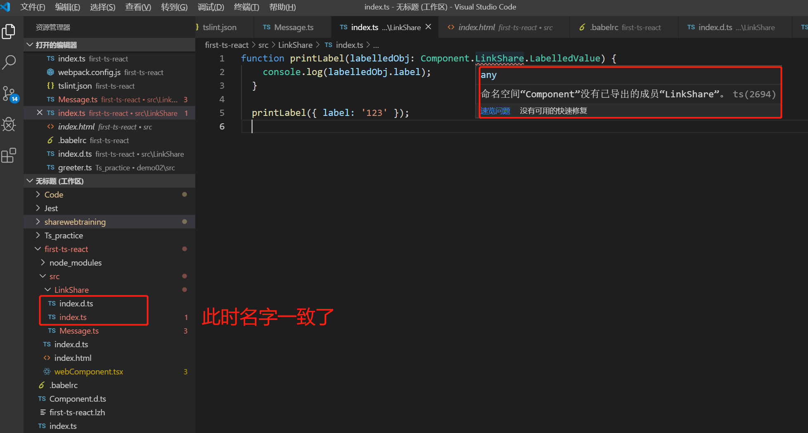
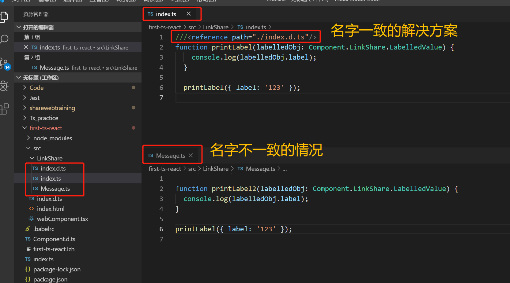

# 徐小杨工作日报

| 作者   | 日期       |
| ------ | ---------- |
| 徐小杨 | 2019.10.25 |

[TOC]

## 一、工作任务完成情况

### 工作任务

1. 今天主要是对AnyShare代码再次熟悉了一下，然后解决了一下统一文档库忘记构建移动web小包，导致移动web上的修改未正确显示出来的问题。===》统一文档库分支测试完成，待合并主线。

2. 对另一个 web登录界面 添加公安备案号的新需求熟悉了一下，大致了解了该需求在web客户端部分需要根据web控制台配置来对web登录界面footer部分添加公安备案号的需求。
3. 参加MISSION AnyShare Family V7启动会 。
4. 参加前端代码规范讲解的课程。

### 学习任务

- 继续学习`index.d.ts`文件。

## 二、学习心得

今天主要是将昨天遗留的一些疑问做了些补充以及所遇到的问题的解决方法。

### 所遇到的问题

遇到的坑：昨天下午一直在思考一个问题，为什么AnyShare项目里不用在`tsconfig.json`中做 `files`、`include` 配置，就可以使`index.d.ts`文件有效？



然后发现是在同级目录下存在`index.ts`文件时，你这时就不需要`index.d.ts`文件，也就是说这时候`index.ts`会导致`index.d.ts`文件不能识别出来。这时候在同级目录下就不能再用相同的前缀名了。

**总结出一句话**：`.d.ts`文件如果和`.ts`或`.tsx`文件存在相同的前缀名称，那么`.ts`或者`.tsx`文件就会导致`.d.ts`文件不能被识别，会报一个“找不到命名空间的错误”，所以为了避免这种问题的出现的话，我们应该避免它们之间的前缀名相同。

如果我非要给`.ts`或者`.tsx`文件取一个与`.d.ts`文件一样的名字，那么如何解决呢?

1. 就是在`tsconfig.json`中做 `files`、`include` 配置。

2. 可以通过使用`///<reference path=""> `语法来解决：

   ```ts
   ///<reference path="./Message.d.ts"/>
   function printLabel(labelledObj: Component.LinkShare.LabelledValue) {
     console.log(labelledObj.label);
   }
   
   printLabel({ label: '123' });
   ```

结果如下：



### `///<reference path=""> ` 是什么？

`///<reference path=""> ` 它是一种注释，告诉typescript编译器，当前文件使用了哪些声明文件，以帮助编辑器提示信息，及编译器检查类型。这种注释很重要，如果后面的路径不对，则编译会失败。 


然后再后面我还遇到一个问题，在ts文件和.d.ts文件不同前缀名的情况下，通过`tsc`编译`ts`文件，编译不通过，报了一个`Cannot find namespace 'Component'`的错？

解决方式是在`.ts`使用`///<reference path=""/> `来解决了编译不通过的问题。


此外还需要注意的点是:

 **在d.ts文件里面，在最外层声明变量或者函数或者类要在前面加上这个关键字。在typescript的规则里面，如果一个`.ts`、`.d.ts`文件如果没有用到import或者export语法的话，那么最顶层声明的变量就是全局变量。** 


## 三、参考资料

- [reference---TS官网]( https://www.tslang.cn/docs/handbook/namespaces.html )

- [index.d.ts与index.ts]( https://stackoverflow.com/questions/51516394/what-is-the-main-usage-of-index-d-ts-in-typescript/51517448 )