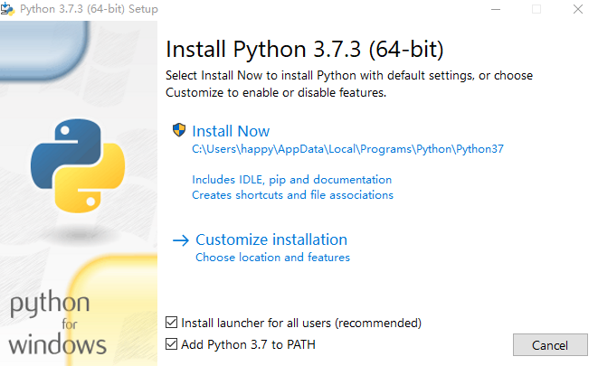
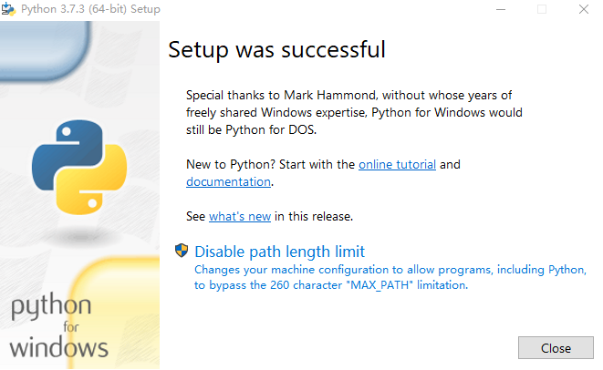

# 03 让 Python 在你的电脑上安家落户

更新时间：2019-11-26 09:47:15


富贵必从勤苦得。

——杜甫

首先，欢迎上车！

从这一章节开始，我们正式学习 Python 相关的内容。学习 Python 不仅仅是认识和记忆它的用法，还要实际动手去操作试验，只有不断地实践才能真正掌握一门语言。所以现在的第一件事是——将 Python 安装到你电脑上，边学习边实践。


## 安装 Python 究竟安装的是什么

我们说「安装 Python」，可是 Python 明明只是种程序语言，为什么有安装不安装之说？其实这只是种笼统的说法，「安装 Python」主要指的是安装 Python 解释器。Python 的代码被编写出来后，要想执行它，就需要用到 Python 解析器，Python 解释器可以直接执行 Python 代码。

> 扩展：与解释器概念有点相似的是**编译器**，如 C、Java、Go 的代码想要被执行，需要先经过编译器的编译（以及链接器的链接），之后生成二进制文件或字节码文件，然后才能被执行。Python 与它们不同，Python 代码可以直接被解释器**解释执行**，也就是说不需要显式的编译过程。


## 安装 Python

由于大家的操作系统不同，故本小节对内容作了划分，请你根据自己的操作系统类型来阅读相应的内容。


### Windows 上的安装

1. 在 Windows 上安装 Python，首先需要去 [Python 官网](https://www.python.org/downloads/windows/) 下载安装程序，方便起见，这里直接给出官网的下载链接：

   [Python 3.7.3 下载](https://www.python.org/ftp/python/3.7.3/python-3.7.3-amd64.exe)

2. 下载完成后打开安装程序，界面上勾选「Install launcher for all users」和「Add Python 3.7 to Path」（**重要**）。


之后点击「Install Now」完成后续的安装。



1. 我们可以通过如下方式来验证安装是否成功，打开命令行（CMD）输入：

   ```python
   python --version
   ```

   > C:> python --version
   >
   > Python 3.7.3

   若命令行中显示「Python 3.7.3」则表明 Python 安装成功，若不是请在讨论区留言大家一起排查问题。


### Linux 上的安装

在个人电脑上使用 Linux 的同学，多数都是在使用它的 Ubuntu 发行版。所以这里以 Linux 的 ubuntu 发行版为例来介绍 Python 的安装过程。

1. 首先，有些版本的 Ubuntu 中可能自带有 Python 3，我们先来确认下。在命令行（虚拟终端）中执行下述命令：

```
 python3 --version
如：

> ➜ ~ python3 --version  Python 3.7.3

若命令行中输出「Python 3.x.x」，表明你的系统中已有 Pyhton 3，可直接跳过安装过程。
```

1. 若上一步中命令行输出「bash: python3: command not found」或类似信息，则表明系统中没有 Python 3，那么执行如下命令安装：

   ```
   sudo apt update -y  
   sudo apt install python3 -y
   ```

2. 验证安装是否成功的方法和步骤 1. 一样。


### MacOS 上的安装

MacOS 上安装 Python，可以去官网下载对应的安装包，但是这里推荐用 Homebrew 来安装。

1. [Homebrew](https://brew.sh/) 是 MacOS 上的包管理工具，可以非常便利地通过命令安装各种软件。既然用了 MacOS，就不能错过 Homebrew。如果你的 MacOS 中没有 Homebrew，可以在命令行（虚拟终端）中执行如下命令来安装：

```
/usr/bin/ruby -e "$(curl -fsSL https://raw.githubusercontent.com/Homebrew/install/master/install)"
> ➜ ~ `/usr/bin/ruby -e "$(curl -fsSL https://raw.githubusercontent.com/Homebrew/install/master/install)"`
> 
> ==> This script will install:  
/usr/local/bin/brew  
...  
Press RETURN to continue or any other key to abort
```

出现提示「Press RETURN to continue or any other key to abort」后敲击回车键继续安装。安 装成功后将输出如下信息：

> ==> Installation successful! …
> ==> Next steps:
> \- Run `brew help` to get started
> \- Further documentation: [https://docs.brew.sh](https://docs.brew.sh/)

1. 之后我们再通过 Homebrew 安装 Python，执行命令：

   ```
    brew update  
    brew install Python3
   ```

2. 要验证安装是否成功，可以执行命令：

   ```
   python3 --version
   ```

   > ➜ ~ python3 --version Python 3.7.3

   若命令行输出「Python 3.x.x」则表明 Python 安装成功，若不是请在讨论区留言大家一起排查问题。


### 小结

到这里 Python 就安装好了，是不是有点迫不及待想去用啦，下一节《如何运行 Python 代码》将会为大家介绍该如何使用刚刚安装好的 Python 解释器，以及怎么用它执行代码。