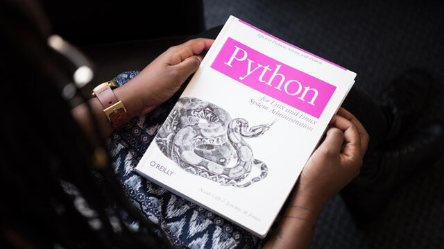

# 26 更加 Python 的 Python 代码风格

更新时间：2019-10-25 10:10:01




你若要喜爱你自己的价值，你就得给世界创造价值。

——歌德


## 代码风格是什么

代码编写好后交由计算机执行，计算机不关心代码文本的布局、各类对象的命名，只要合乎语法和语义，代码就可按预期被执行。

围绕着代码，人（开发者）的作用看起来似乎只是单纯地输出代码。其实不然，开发者不仅输出代码，也需要从代码中获取信息，需要经常性地阅读代码。

阅读代码的过程可能发生在开发调试、维护修改 bug 时，毕竟开发者的记忆是有限的，自己写过的代码可能在不久后便会有遗忘，日后需要反复回顾以确认细节。另一个阅读代码的典型情形是，开发过程中往往不是一个人在写代码，通常需要进行团队协作，这时我们可能需要阅读别人的代码以便熟悉对方的代码逻辑。

总而言之，代码不仅仅是被用来执行的，也会被开发者经常性地阅读，无论这些代码是自己所写还是别人所写。

良好的、统一的代码风格会给阅读带来非常大的便利，能尽可能地降低代码阅读障碍，提升阅读效率。同时对于编码者来说，良好的、统一的代码风格能让人有一种固定的模式可依循，以便写出高可读性的代码。

我们可以在公司或部门这个层面制定 Python 代码风格，将其用于各个项目，每个开发者遵从这些代码风格来编写代码。

当然我们也有更省事、更通用的方法，使用 Python 社区所制定的 [Python 代码风格](https://www.python.org/dev/peps/pep-0008/)（PEP 8）。这其中非常详细地列举出了应该遵守的代码风格，在这里我们只选取其中重要的、常用的部分进行介绍。


## 命名

Python 中的命名主要有三种风格：

1. 全小写+下划线：所有字母均使用小写形式，多个单词时用下划线（`_`）分隔，如 `response`、`message_body`、`seconds_per_hour`
2. 全大写+下划线：所有字母均使用大写形式，多个单词时用下划线（`_`）分隔，如 `DATETIME`、`MAX_SEGMENT_LIFETIME`
3. 驼峰写法：一个或多个单词，每个单词的首字母大写，如 `String`、`CurrentTime`

每种风格有不同的使用场景，不可随意使用，具体如下。


### 变量和函数

变量和函数使用「全小写+下划线」的命名方式：

```python
seconds_per_day
print_hello()
```


### 类名

类的命名采用「驼峰写法」：

```python
MyClass
```


### 异常名

异常也是类，所以也使用「驼峰写法」，并且以「Error」结尾：

```python
FileParseError
```


### 常量

常量使用「全大写+下划线」命名：

```python
MAX_RETRY_TIMES
```


### 模块名和包名

包名和模块名应该短小。

模块可使用「小写 + 下划线」的方式命名：

```python
open_api
```

包名仅使用小写字母命名，其中不建议使用下划线：

```python
requests
```


## 缩进、换行


### 缩进

Python 代码格外注重缩进，强制用缩进来区分代码块，以及子代码块。

每级缩进应使用 4 个空格。

```python
def func():
	for i in range(x):
        if condition：
            pass
```

有时我们习惯于使用 Tab 键来缩进代码，这时可在编辑器或 IDE 中将 Tab 键的效果设置为 4 个空格。


### 换行

每行代码的最大字符数为 79。若某一行代码过长，可以将其换行书写。

定义函数时，将参数换行后**缩进两次**，以和代码块相区分。

```python
# 建议：
def long_function_name(
        var_one, var_two, var_three,
        var_four):
    print(var_one)

# 不建议：
def long_function_name(
    var_one, var_two, var_three,
    var_four):
    print(var_one)
```

函数调用时，若左括号后紧跟参数，后续行与左括号对齐。

```python
# 建议：
foo = long_function_name(var_one, var_two,
                         var_three, var_four)

# 不建议：
foo = long_function_name(var_one, var_two,
    var_three, var_four)
```

函数调用时，若左括号后没有参数，后续行可任意缩进，无需与左括号对齐。

```python
# 建议：
foo = long_function_name(
    var_one, var_two,
    var_three, var_four)
```

多行结构中（列表、元组、集合、函数参数列表），其中元素及右括号可换行书写。

```python
# 右括号可与元素对齐
my_list = [
    1, 2, 3,
    4, 5, 6,
    ]

result = some_function_that_takes_arguments(
    'a', 'b', 'c',
    'd', 'e', 'f',
    )

# 右括号也可顶格书写
my_list = [
    1, 2, 3,
    4, 5, 6,
]

result = some_function_that_takes_arguments(
    'a', 'b', 'c',
    'd', 'e', 'f',
)
```

Python 中小括号、中括号、大括号中的对象可以直接被换行，而无需添加其它符号（这叫隐式换行），如上。但其它情况下，代码换行书写，需要在每行末尾添加反斜杠（`\`）。

```python
with open('/path/to/some/file/you/want/to/read') as file_1, \
     open('/path/to/some/file/being/written', 'w') as file_2:
    file_2.write(file_1.read())
```

定义函数和类时，多个函数或类之间使用**两个空行**进行分隔：

```python
def foo1():
  	pass


def foo2():
		pass
  

class MyClass1:
  	pass
  

class MyClass2:
  	pass
```

类中的定义方法时，多个方法间用**一个空行**进行分隔。


## 导入

使用 `import` 时，`import` 语句应位于文件顶部，模块注释和文档字符串之后。

`import` 按下列类型和顺序使用：

1. 标准库导入
2. 第三方库导入
3. 本地库导入

以上分为三个分组，每个分组间用一个空行分隔。


## 注释

1. 注释以 `#` 及一个空格开始
2. 行内注释和代码间至少要有两个空格分隔
3. 注释与代码矛盾比没有注释更糟，修改代码前首先修改注释
4. 注释应该是完整的句子或短句，并且第一个单词首字母大写


## 完整代码风格内容

以上是常用的代码风格说明，关于 Python 完整的代码风格指导，可以阅读 [PEP 8 – Style Guide for Python Code](https://www.python.org/dev/peps/pep-0008/)（英文原版），也可以自行搜索「PEP 8 翻译」。建议大家仔细阅读。

[
  ](https://www.imooc.com/read/46/article/834)