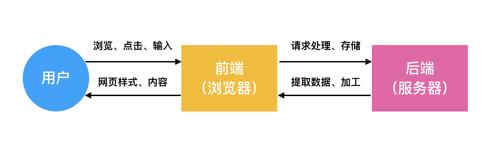

28 Web 开发

更新时间：2019-11-01 09:51:58

勤学如春起之苗，不见其增，日有所长。

——陶潜

Web 开发，即 Web 应用开发，简单来说就是开发网站。

对于一个网站项目，其工作内容可以划分为两个主要部分——前端和后端。

前端负责在浏览器中，向用户展示网页的样式、内容，并与用户交互，处理用户的点击和输入。

以一个简单的博客网站为例，前端负责将网站的样式、博客列表、博客内容等信息展示到浏览器中，并接受用户点击阅读帖子的操作，以及创建帖子和评论的操作。

后端负责接受前端的任务请求，根据需要提取、转换数据并返回给前端；或将前端发送过来的数据记录下来，长久保存到数据库中；或在背后处理一些任务。

在博客网站中，前端向后端请求博客列表数据、博客内容数据，后端从数据库中提取出这些数据，加工后返回给前端。用户创建帖子或评论时，前端接受输入并发送给后端，后端加工后将其记录在数据库中。

上面这个过程会涉及哪些技术呢？

我们一一来看看：

1. 前端展示网页样式和内容，用到 CSS、HTML、前端框架
2. 前端处理用户交互，用到 JavaScript、前端框架
3. 前端与后端交换数据，用到 JavaScript、HTTP（RESTful API）
4. 后端处理前端的请求，用到 Python、后端 Web 框架
5. 后端提取已被长久保存的数据，或记录需长期保存的数据，用到数据库，如MySQL
6. 网站的部署，用到一些 Linux 命令或 Shell 脚本
7. 当网站规模很大时，后端可能会用到消息队列、缓存、负载均衡、微服务等高级技术

其中，如果前端与后端交换数据时使用 RESTful API，那么后端部分将变得更加通用，不仅能应用于网站，也能应用于 iOS 应用、安卓应用、小程序，也就是说后端的技术栈在这些应用中是通用的。

看可看出，Python 的职责在后端部分，如果你想成为一个 Python 后端开发者，只需要关注和学习后端部分即可，至于前端部分，由前端开发者完成，之后直接通过 HTTP 接口与其对接。如果你想成为全栈开发，能独立开发一个完整网站的全能型选手，那前、后端技术都应该去学习掌握。

以下提供一些入门资料，比较基础易学，供你参考：

- HTML、CSS ： 慕课网《[初识HTML+CSS](https://www.imooc.com/learn/9)》
- JavaScript：慕课网《[JavaScript入门篇](https://www.imooc.com/learn/36)》《[JavaScript进阶篇](https://www.imooc.com/learn/10)》
- 前端框架：慕课网 Vue《[vue2.5入门](https://www.imooc.com/learn/980)》，React《[React16.4 快速上手](https://www.imooc.com/learn/1023)》，二选一即可
- HTTP：图书《[图解HTTP](https://book.douban.com/subject/25863515/)》
- 后端 Web 框架：图书《[Flask Web开发：基于Python的Web应用开发实战](https://book.douban.com/subject/26274202/)》（**强烈推荐**）
- 数据库 MySQL：慕课网《[与MySQL的零距离接触](https://www.imooc.com/learn/122)》
- ORM 数据库操作框架：翻译文档《[Flask-SQLAlchemy 快速入门](http://www.pythondoc.com/flask-sqlalchemy/quickstart.html)》
- Linux：慕课网《[Linux达人养成计划 I](https://www.imooc.com/learn/175)》

加油吧！