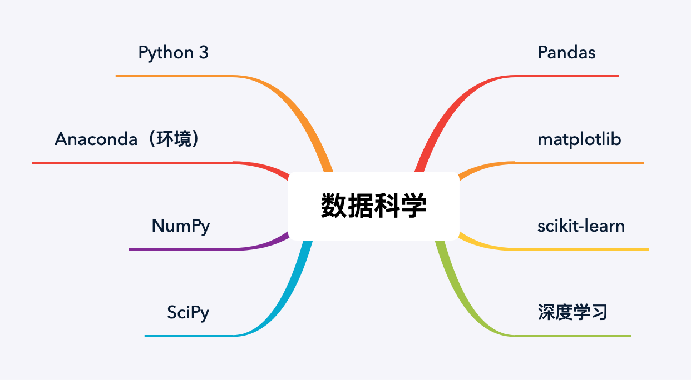

29 数据科学

更新时间：2019-11-04 09:46:21

没有智慧的头脑，就像没有蜡烛的灯笼。

——托尔斯泰

数据科学的基本技术栈如下，包含 Python、数据统计分析、机器学习相关内容：

### 开发环境

数据科学中，最方便的、最常使用的环境是 Anaconda，它自带 Python 以及众多数据科学相关的第三方库，一步安装所有依赖，省时省力。

> Anaconda 是一个免费开源的 Python 和 R 语言的发行版本，用于计算科学（数据科学、机器学习、大数据处理和预测分析）。Anaconda 可简化包管理和部署，拥有超过 1400 个适用于 Windows、Linux 和MacOS 的数据科学软件包。

### 数据科学工具库

Python 数据科学有几个常用的库需要掌握：

- NumPy:

> 基于 Python 的科学计算第三方库，提供了矩阵，线性代数，傅立叶变换等等的解决方案。

- Pandas：

> 用于数据分析、数据建模、数据可视化的第三方库。

- matplotlib：

> 用 Python 实现的类 matlab 的第三方库，用以绘制一些高质量的数学二维图形。

- SciPy：

> SciPy 是一个开源的 Python 算法库和数学工具包。包含的模块有最优化、线性代数、积分、插值、特殊函数、快速傅里叶变换、信号处理和图像处理、常微分方程求解和其他科学与工程中常用的计算。

- scikit-learn：

> 机器学习第三方库，实现许多知名的机器学习算法。

### 入门资料

上面的这些工具库的官方入门文档（译文）如下，从官方入门文档着手学习，不失为一个好的选择。

- NumPy 入门资料：《[NumPy 快速入门教程](https://www.numpy.org.cn/user/quickstart.html)》
- Pandas 入门资料：《[Pandas 快速入门](https://www.pypandas.cn/docs/getting_started/)》
- matplotlib 入门资料：《[matplotlib 教程](https://www.matplotlib.org.cn/tutorials/)》
- SciPy 入门资料：《[SciPy tutorial](https://docs.scipy.org/doc/scipy/reference/tutorial/index.html)》
- scikit-learn 入门资料：《[scikit-learn (sklearn) 官方文档中文版](https://sklearn.apachecn.org/docs/0.21.3/)》

如果你想要通过视频课程快速的了解它们的用法，不妨先看下慕课网的免费课程《[Python数据分析-基础技术篇](https://www.imooc.com/learn/843)》。这个课程不仅介绍了 Anaconda 的安装，也介绍了上面这些工具库的核心用法。

关于上述工具库的更详细的方法和要点，可以阅读图书《[利用Python进行数据分析 原书第2版](https://book.douban.com/subject/30283996/)》，Pandas 作者亲自撰写，兼具权威性和易读性。

关于数据科学相关技术的原理和理论知识，可以阅读图书《[数据科学入门](https://book.douban.com/subject/26741078/)》，深入浅出，适合学习了解。

最后，如果想要手把手教学，可以考虑学习慕课网的付费实战课程《[Python数据分析入门与实践](https://coding.imooc.com/class/156.html)》。

由于数据科学并不是笔者的主业，所以这里只推荐这些基础的资料。更多学习规划，可以参考 [Comprehensive learning path – Data Science in Python](https://www.analyticsvidhya.com/learning-paths-data-science-business-analytics-business-intelligence-big-data/learning-path-data-science-python/)（其[译文](https://zhuanlan.zhihu.com/p/23229114)）。

