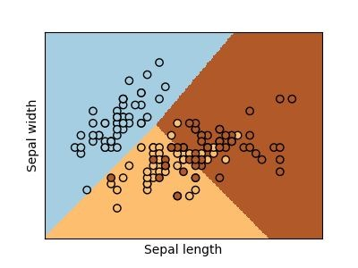

31 机器学习

更新时间：2019-11-08 09:51:46

最聪明的人是最不愿浪费时间的人。

——但丁

对于机器学习，笔者确实是门外汉，所以这里**引用一篇很不错的文章，《如何用3个月零基础入门「机器学习」？》，作者 @微调，出处 https://zhuanlan.zhihu.com/p/29704017 。引用已征得原作者同意**

## **0. 背景**

写这篇教程的初衷是很多朋友都想了解**如何入门/转行机器学习**，搭上人工智能这列二十一世纪的快车。**文章的宗旨是：1. 指出一些自学的误区 2. 不过多的推荐资料 3. 提供客观可行的学习表 4. 给出进阶学习的建议。**

这篇文章的**目标读者**是计划零基础自学的朋友，对数学/统计/编程基础要求不高，比如：

- 在读学生
- 非计算机行业的读者
- 已经工作但想将机器学习/数据分析和自己的本职工作相结合的朋友

因此，这篇文章对于已经身处机器学习领域的人士可能帮助不大。请大家有选择的性阅读，探索适合自己的学习方法。

## **1. 自学机器学习的误区和陷阱**

**1.1. 不要试图掌握所有的相关数学知识再开始学习**

在很多[相关的回答](https://www.zhihu.com/question/60064269/answer/172305599)中，我都一再强调不要试图补足数学知识再开始学习机器学习。一般来说，大部分机器学习课程/书籍都要求：

- 线性代数：矩阵/张量乘法、求逆，奇异值分解/特征值分解，行列式，范数等
- 统计与概率：概率分布，独立性与贝叶斯，最大似然(MLE)和最大后验估计(MAP)等
- 优化：线性优化，非线性优化(凸优化/非凸优化)以及其衍生的求解方法如梯度下降、牛顿法、基因算法和模拟退火等
- 微积分：偏微分，链式法则，矩阵求导等
- 信息论、数值理论等

一般人如果想要把这些知识都补全再开始机器学习往往需要很长时间，容易半途而废。而且这些知识是工具不是目的，我们的目标不是成为优化大师。**建议在机器学习的过程中哪里不会补哪里，这样更有目的性且耗时更低。**

**1.2. 不要把深度学习作为入门第一课**

虽然很多人都是冲着深度学习来的，但把深度学习作为机器学习第一课不是个好主意。原因如下：

- 深度学习的黑箱性更加明显，很容易学得囫囵吞枣
- 深度学习的理论/模型架构/技巧还在一直变化当中，并未尘埃落定
- 深度学习实验对硬件要求高，不太适合自学或者使用个人电脑进行学习

更多讨论可以看我的回答：[深度学习的教学和课程，与传统 CS 的教学和课程有什么区别？](https://www.zhihu.com/question/63883727/answer/225499427)

**1.3. 不要收集过多的资料 & 分辨资料的时效性**

机器学习的资料很多，动辄就有几个G的材料可以下载或者观看。而很多朋友都有“收集癖”，一下子购买十几本书的人我也常常能够看到。

机器学习的发展和变化速度很快。在入门期间，**建议“小而精”的选择资料，选择近期出版的且口碑良好的书籍**。我不止一次的提到这个例子：

> 在很多深度学习的教科书中，尤其是10年以前的教科书中都还依然把Sigmoid当作默认的激活函数。但事实上，整流函数(ReLu)以及其拓展变形函数，如Leaky ReLu早就成为了主流的深度学习激活函数。但因为知识的滞后性，很多课程/书籍甚至都没有介绍ReLu的章节。

一般来说，我比较推荐近5年内出版的书籍，或者10年以后出版的书籍。有些书籍虽然是经典，比如Tom Mitchell的《机器学习》，但因为其出版已经超过20年，还是不建议大家购买。

在这篇文章中我所推荐的书籍和课程都相对比较经典，同时属于紧跟时代潮流的。入门阶段我推荐了1门课程和2本书，进阶阶段推荐了1本书，深度学习推荐了1门课程一本书，高级阶段推荐了2本额外书籍。

## **2. 机器学习的一些前期准备**

**2.1. 硬件选择**

另一个大家常问的问题是：是否可以用自己的笔记本电脑进行机器学习。答案是肯定的，大部分市面上的数据集都可以放到你的内存中运行。在入门阶段，我们很少会用到非常大的数据集，一般最大也就是MNIST，完全可以使用个人笔记本电脑进行运行。在Windows笔记本上也可以用GPU进行深度学习，参见我的教程：[用GPU加速深度学习: Windows安装CUDA+TensorFlow教程](http://zhuanlan.zhihu.com/p/29841665)。**请不要打着学习的名义重新购买机器…**

**2.2. 软件选择**

如果要做深度学习，Linux还是首选，因为其对很多学习模型支持比较好（主要是深度学习的Library）。但即使你使用的是Windows系统，也可以用虚拟机装Ubuntu来进行学习。小型的深度学习模型足够了，大型的深度学习我们很少在本地/个人计算机上运行。

至于编程语言，首推Python，因为其良好的拓展支持性，主流的工具包都有Python版本。在特定情况下，选择R作为编程语言也是可以的。其他可能的语言还包括C++、Java和Matlab，但我个人不大推荐。

此处也想额外提一句，因为编程属于机器学习基本要求之一，所以推荐大家可以自学一些基础编程的知识(如Python)，在文中不再赘述。

**2.3. 语言能力**

学好英语，至少打下阅读和听力的基础。**虽然人工智能领域中国现在已经做得很不错，但主流的书籍、期刊和会议，资料都是英文的**。我们可以接受翻译版，但最好的方法还是自己有能力直接阅读。即使你将来不做机器学习，英文阅读能力还是会有很大的帮助。

## **3. 机器学习课程表**

## 3.1. 第一阶段：基础入门(3-6个月)

入门的第一步是学习一些经典课程并配套经典书籍，一般来说这个过程在半年之内比较合适。在这个部分我介绍的课程和书籍都属于难度非常低的，对数学和编程都没什么太大的要求。

**3.1.1. 吴恩达Cousera机器学习课程**

Andrew Ng的机器学习课程（[Machine Learning | Coursera](https://link.zhihu.com/?target=https%3A//www.coursera.org/learn/machine-learning)）是很多人的启蒙课程，难度适中且完全免费。Coursera上总共有49285个人给出了评分，平均得分4.9分，满分5分。据我个人观察，大部分Coursera上的课程评分处于4-4.5分之间，能做到4.9分的课程寥寥无几。另一个值得关注的是，这门课有接近五万人给出评分，统计学知识告诉我们这个样本较大所以评分应该趋近于其真实值，比较可信。根据Freecodecamp的[统计](https://link.zhihu.com/?target=https%3A//medium.freecodecamp.org/every-single-machine-learning-course-on-the-internet-ranked-by-your-reviews-3c4a7b8026c0)，这门课是所有在线Machine Learning课程中最受到大家好评的课程。另一个比较直接的观察是如果大家在知乎上搜索“机器学习如何入门？”，大部分答案都提到了Andrew的这门入门课程，所以这是一门绝对的口碑课程，详细讨论可以参考：[微调：为何国人迷恋吴恩达的机器学习课？](https://www.zhihu.com/question/65780182/answer/234983030)。

**3.1.2. Python机器学习 & Introduction to Statistical Learning with R**

在学习吴恩达的在线课程时，推荐同时阅读相关的机器学习书籍**补充理论知识**。我再次推荐这两本非常好的入门书籍，在我的专栏也有对于这两本书的介绍。

- **Python机器学习（**作者 Sebastian Raschka）：这本书出版于2015年并多次再版，在亚马逊中国上我们可以找到影印版和翻译版。这本书去掉了大量的数学推导的部分，仅保留了机器学习的核心应用。阅读本书可以快速对如何使用Python机器学习框架Sklearn有一个基本的了解，可以很快上手开始工作。本书涉及的内容很广泛，虽然只有400多页，但内容涉及了数据预处理(Data Preprocessing), 维度压缩和核函数(Dimension Reduction & Kernel)，评估方法如交叉验证，集成学习，情感分析，聚类，甚至还包括了神经网络和Theano。更多介绍：[带你读机器学习经典(三): Python机器学习(Chapter 1&2)](https://zhuanlan.zhihu.com/p/28647608)。除此之外，也想特别推荐最近新出的一本Python机器学习类书籍：《[Hands-On Machine Learning with Scikit-Learn and TensorFlow](https://link.zhihu.com/?target=http%3A//shop.oreilly.com/product/0636920052289.do)》。
- **Introduction to Statistical Learning with R（ISL）**：相信正在机器学习苦海中遨游的朋友们肯定都听过大名鼎鼎的The Element of Statistical Learning, 这本频率学派的统计学习“圣经”被大家叫做ESL。而ISL正是基于满足更广大阅读人群的目的而推出的；ISL是ESL的入门版，不仅大量的去除了繁复的数学推导，还加入了R编程的部分，方便大家可以尽快上手。**这本书是我推荐书单第一名**：ISL的电子版是免费的：[点击下载](https://link.zhihu.com/?target=http%3A//www-bcf.usc.edu/~gareth/ISL/ISLR First Printing.pdf)。更多介绍：[带你读机器学习经典(一): An Introduction to Statistical Learning (Chapter 1&2)](https://zhuanlan.zhihu.com/p/27556007)

**3.1.3. 周志华《机器学习》**

周志华老师的《机器学习》也被大家亲切的叫做“西瓜书”。虽然只有几百页，但内容涵盖比较广泛。然而和其他人的看法不同**，我建议把西瓜书作为参考书而不是主力阅读书**。西瓜书因为篇幅的限制，涵盖了很多的内容但无法详细的展看来讲，对于初学者自学来说实际阅读难度很大。这本书更适合作为学校的教材或者中阶读者自学使用，入门时学习这本书籍难度稍微偏高了一些。

我个人建议的用法是在学习网课和阅读ISL遇到疑惑时可以参考西瓜书的相关章节，但入门阶段没有必要一章一章的阅读，建议在这个阶段只阅读前十章即可。

## 3.2. 第二阶段：进阶学习(3-6个月)

在这个阶段，你已经对机器学习有了基本的了解。如果你认真的阅读了ISL并上完了吴恩达的课程，我相信你已经在理论上明白了什么是线性回归，什么是数据压缩，对特征工程以及简单的回归/预测问题有了理论上的基础。这个时候最重要的就是进行实践！

**3.2.1. Kaggle挑战赛/练习**

Kaggle（[Your Home for Data Science](https://link.zhihu.com/?target=https%3A//www.kaggle.com/)）在数据分析领域早已大名鼎鼎，甚至可以说是数据分析第一社区，前一阵子刚刚被谷歌收购。Kaggle上有很多很好的数据集和挑战赛，你可以尝试这些挑战取得名次，甚至拿到奖金，对于将来找工作也非常有帮助。而且Kaggle的另一大优势是网友会分享他们的经验和看法，你也可以提出问题让大家来帮你提出一些修正方法。

国内也有类似的平台，比如天池大数据竞赛，其他类似的平台还包括DataCastle。

**使用Kaggle的目的主要是将技能落在实处，防止练就一身屠龙之技。机器学习最大的幻觉就是觉得自己什么都懂了，但等到真的使用时发现并不奏效**，而Kaggle是一个低成本的应用机器学习的机会。

**3.2.2. Sklearn文档学习**

Sklearn([scikit-learn: machine learning in Python](https://link.zhihu.com/?target=http%3A//scikit-learn.org/stable/))是Python上最流行的机器学习/数据科学工具包，上文介绍的Python Machine Learning书中就大量使用Sklearn的API。和使用Kaggle的目的一致，学习的Sklearn的文档也是一种实践过程。比较推荐的方法是把主流机器学习模型Sklearn中的例子都看一遍。

Sklearn的文档是少数写的跟教程一样的技术文档，很具有阅读价值。举个简单的例子，假设你想学习Python中使用逻辑回归，就可以参考: [Logistic Regression 3-class Classifier](https://link.zhihu.com/?target=http%3A//scikit-learn.org/stable/auto_examples/linear_model/plot_iris_logistic.html%23sphx-glr-auto-examples-linear-model-plot-iris-logistic-py)

Sklearn的文档不仅提供了练习数据、sklearn的相关代码实例，还提供了可视化图。

**3.2.2. 周志华机器学习**

再次提到周老师是因为西瓜书是值得常常翻看的一本书，在kaggle挑战和阅读Sklearn文档的过程中你还会时不时的遇到一些新的名词，比如流形学习(manifold learning)等。这个时候你会发现西瓜书真的是一本中级阶段大而全的书籍:)

## 3.3. 第三阶段(可选*)：深度学习(3-6个月)

因为深度学习是当下的热点，很多公司都在寻找深度学习人才。虽然深度学习只是机器学习的一个子集，但有兴趣朝这个方向发展的朋友可以在完成以上学习后单独学习一下深度学习。

**3.3.1. 吴恩达深度学习课程**

吴恩达在八月份的时候通过Deeplearning.ai和Coursera平台推出了最新系列的五门深度学习课程([deeplearning.ai](https://link.zhihu.com/?target=https%3A//www.deeplearning.ai/))。有条件的朋友可以通过Coursera学习获得证书，最近网易云课堂也上线了这门课的翻译版。如果想要上其中的课程，需要先注册报名「深度学习工程师微专业」 [深度学习工程师微专业 - 一线人工智能大师吴恩达亲研-网易云课堂 - 网易云课堂](https://link.zhihu.com/?target=http%3A//mooc.study.163.com/smartSpec/detail/1001319001.htm)，之后就可以分别点开每门课单独进行学习。

更多关于网易云课堂上深度学习课程的介绍可以看：[如何评价网易云课堂上线的吴恩达Deep Learning课程？](https://www.zhihu.com/question/64615398/answer/222596302)

**3.3.2. Deep Learning - by Ian GoodFellow**

深度学习这本书是由当下深度学习领域的几位领军人物所著，包含三大巨头之一的Bengio，还有教父Hinton来作序推荐。这本书的中文本翻译由张志华教授团队负责，在github上免费放出了翻译版本，印刷版也可以从亚马逊中国上买到。

英文版：[Deep Learning](https://link.zhihu.com/?target=http%3A//www.deeplearningbook.org/)

中文版：[exacity/deeplearningbook-chinese](https://link.zhihu.com/?target=https%3A//github.com/exacity/deeplearningbook-chinese)

这本书的阅读建议：

- 为了补充基础可以阅读第1-5章其中也包含了一些数学知识
- 只关注主流神经网络知识可以阅读6-10章，介绍了DNN/CNN/RNN
- 需要进一步了解一些调参和应用技巧，推荐阅读11和12章

第13-20章为进阶章节，在入门阶段没有必要阅读。其实比较实际的做法是吴恩达的课程讲到什么概念，你到这本书里面可以阅读一些深入的理论进行概念加深，按章节阅读还是比较耗时耗力的。

## 3.4. 第四阶段：深入研究

恭喜你！如果你已经完成了上面的计划表，代表你已经有了相当的机器学习能力。这个阶段，最重要的就是不要贪多嚼不烂。如果你浏览知乎，会发现大家都说你必须读Elements of Statistical Learning， MLAPP之类的大部头。我承认阅读这样的书会有帮助，但在你有了一定的基础知识后，相信你已经知道自己需要接着做什么了也有了志同道合的朋友，我希望把选择权交还给你，而不是继续推荐成堆的课程和书籍。当然，如果你希望继续深入的话，中文可以继续阅读周志华老师的《机器学习》和李航老师的《统计学习基础》，英文可以入手《Elements of Statistical Learning》。**在这个阶段，重点要形成成体系的知识脉络，切记贪多嚼不烂，切记！**

从阅读论文角度来说，订阅Arxiv，关注机器学习的顶级会议，如ICML/NIPS/KDD等，相关的方法在知乎上可以很容易搜索到，不在此赘述。

## **4. 实践经验**

**4.1. 研究经历**

如果你还是学生，尝试尽早接触科研，进实验室。一般来说，大三的时候你应该已经有了基本的机器学习知识，尽管还比较浅。这个时候可以向老师/学长/学姐毛遂自荐进实验室，即使是无偿劳动和做基本的苦力活。进实验室有两个明显的好处：

- **对某个小方向会有比较深入的了解**。一般实验室做纯理论的不大需要本科生，做机器视觉或者自然语言处理(NLP)等小方向的比较需要本科生，所以这是很好的深入了解一个方向的机会。
- 补充了研究经历也可以明白自己是否适合这个领域。如果运气好的话，你也有可能成为论文的作者之一，甚至可以去开会(公款旅游顺道见一下业内大佬)。**这对于继续深造和去国外继续学习都很有帮助，有科研经历和论文是很大的筹码，对于找工作来说也绝对有利无害。**>
  **4.2. 企业实习**

上文提到过，机器学习光说不练假把式，最好的方法还是要实践。**因此，应该先试着做科研，再尝试工业界实习。对待科研机会，有则就上，没有也不是太大的遗憾。**我建议大部分做机器学习的朋友尽早实习，主要出于以下几个考量：

- **打破幻想，了解工业界的主流模型**。在其他很多答案中我都提到过，其实工业界用的大部分技术并不酷炫，你很少能看到深度强化学习那种AlphaGo一样酷炫的模型。不夸张的说，广义线性模型(generalized linear models)还是占据了大壁江山，这要归功于其良好的解释能力。从神经网络角度出发，一般也逃不过普通任务深度网络、视觉任务卷积网络CNN、语音和文字任务LSTM的套路。
- **补上学术界忽视的内容，比如可视化和数据清洗**。工业界的最终目的是输出商业价值，而获得商业洞见的过程其实是非常痛苦的，比如第一步就是令人深恶痛绝的数据清洗。毫不夸张的说，工业界百分之六十的时间都在清理数据，这和学术界干净且规则化的现成数据完全不同。没有在工业界体验过的人，无法真的了解原来机器学习从头到尾有那么多陷阱，泛化能力只是终极目标，而往往我们连规整的数据都无法得到。
- **了解技术商业化中的取舍，培养大局观**。做技术的人往往一头扎进技术里面，而忽视了从全局思考。举个例子，模型A的准确率95.5%，每次训练时间是3天，需要6台有GPU的服务器。而模型B的准确率是百分之95.2%，但只需要一台普通的macbook训练4个小时就可以了。从学术角度出发我们往往追求更好的模型结果选A，而工业界还要考虑到训练开销、模型可解释性、模型稳定度等。到工业界实习不仅可以培养大家的宏观掌控能力，对将来自己带学生控制开销或者选题也大有帮助

**4.3. 在本职工作中使用机器学习**

对于大部分已经工作的朋友来说，重新回到学校攻读学位并不现实，进研究室进行学习更是缺少机会。那么这个时候，你就可以试着把机器学习应用到你自己的工作当中。

已经有了工作/研究经验的朋友，要试着将自己的工作经历利用起来。举例，不要做机器学习里面最擅长投资的人，而要做金融领域中最擅长机器学习的专家，这才是你的价值主张(value proposition)。最重要的是，机器学习的基本功没有大家想的那么高不可攀，没有必要放弃自己的本专业全职转行，沉没成本太高。通过跨领域完全可以做到曲线救国，化劣势为优势，你们可能比只懂机器学习的人有更大的行业价值。

举几个我身边的例子，我的一个朋友是做传统软件工程研究的，前年他和我商量如何使用机器学习以GitHub上的commit历史来识别bug，这就是一个很好的结合领域的知识。如果你本身是做金融出身，在你补足上面基本功的同时，就可以把机器学习交叉运用于你自己擅长的领域，做策略研究，我已经听说了无数个“宣称”使用机器学习实现了交易策略案例。虽不可尽信，但**对特定领域的深刻理解往往就是捅破窗户的那最后一层纸，只理解模型但不了解数据和数据背后的意义，导致很多机器学习模型只停留在好看而不实用的阶段**。

## **5. 写在最后**

虽然人们曾说二十一是生物的世纪，但现在还是人工智能的世纪。欢迎大家来试试机器学习，体验数据分析的魅力。

就像我曾在很多回答中提到，机器学习领域应该要敞开大门，让每个人都可以尝试将机器学习知识应用于他们原本的领域，摒弃人为制造的知识壁垒。唯有这样，机器学习技术才能在更多的不同领域落地，从而反哺机器学习研究本身。

科技日新月异，追逐热点是好的。但在这个浮躁的时代，**不管选择什么方向最重要的就是独立思考的能力，和去伪存真的勇气。因此，看了这么多入门教程和经验分享后，我最希望的是你既不要急着全盘接受，也不要因为不对胃口全盘否定。慢下来，好好想想，制定适合自己的计划，这大概才是做科学工作的正确态度。**

> **在思考之后，拒绝外界的噪音，无论是鼓励还是嘲笑。抱着“不撞南山不回头”的信念，继续朝机器学习的高峰攀登。好运！**

