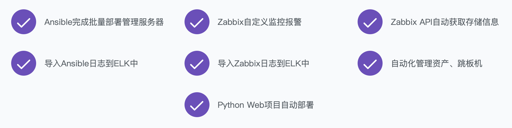

# 32 自动化运维和测试

更新时间：2019-11-11 14:34:43

天才就是长期劳动的结果。

——牛顿

# 6.5 自动化运维和测试路线图

## 自动化运维

我们说 Python 可以做自动化运维，但其实在这个领域中，Python 开发所占的比重并不是特别高。

对于一个成熟的可自动化运维的系统，主要的关注点有以下这些：

- CMDB（Configuration Management Database），设备数据
- 监控
- 批量运维
- 日志管理
- 持续集成与发布
- 安全漏洞扫描

这其中的每个点都是可以被部分甚至全部自动化的，可以看出所涉及的工作还是很多的，同时技术栈也五花八门。

一些比较典型的技术栈/工具如下：

- 运维部署：Ansible
- 监控：Zabbix
- 日志收集分析：ELK（Elasticsearch、Logstash、Kibana）
- 代码版本管理：Git
- 持续集成：Jenkins

对于上述工具的学习使用，可以学习实战课程《[中小型企业通用自动化运维架构](https://coding.imooc.com/class/239.html)》，下图是其课程案例，都很实用。

## 自动化测试

对于测试而言，常规的测试方法是通过手工和肉眼来验证功能的正确性，当然我们也有更高效的方法，通过程序自动化地完成一部分这样的工作。比如，对于 Web 页面的测试，可以使用 Selenium 来模拟页面上的点击等操作，并自动进行正确性验证，以此达到自动化的目的。

对于接口的测试而言，可以使用 requests 库和 Fiddler 抓包工具来验证分析。

以下是一些常用的自动化测试知识：

- HTML
- Selenium
- HTTP
- Python 的 requests 库
- Fiddler

想要系统地进行学习，可以考虑这两个实战课程，对自动化测试的很多知识都有覆盖：

- 《[零基础入门 Python Web 自动化测试](https://coding.imooc.com/class/299.html)》
- 《[Python接口自动化测试框架实战 从设计到开发](https://coding.imooc.com/class/374.html)》