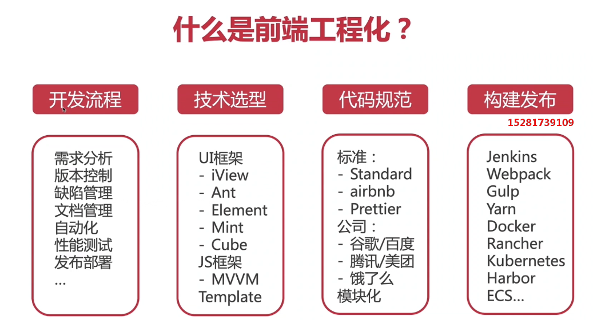
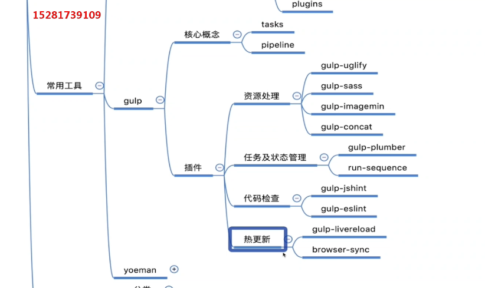

# 前端工程化

什么是前端工程化？

前端工程化是指将前端开发的流程规范化、标准化、

包括开发流程、技术选型、代码规范、构建发布等，用于提升前端工程是的开发效率和代码质量。

为什么要前端工程化？

- 复杂度高：前端项目多功能、多页面、多状态、多系统
- 规模大：团队开发，多人协作，代码质量管理
- 要求高：页面性能优化（CDN/异步加载/请求合并），CSS兼容性、单页面应用、服务端渲染

如何做到前端工程化？

- 从业务着手

  简单的单页面应用，使用gulp打包+同步工具实现开发全流程

- 从复杂度考虑

  框架最终要服务于我们的项目，而非累死累活的去维护框架

  jenkenis   git/gitlab    webpack   React/Vue/Angular

- 从已知向未知扩展

  不同的技术有不同的适应点，选择适合的才是最好的

  

考虑：

- 前后端技术是否更好的融合
- 前后端分离，接口安全性
- vue或react是否适合制作静态页面
- php是否更好的集合

