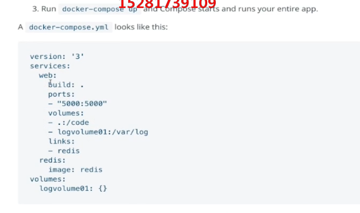
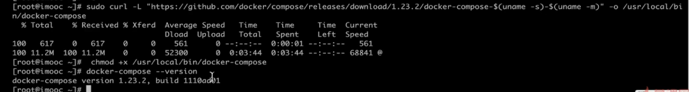
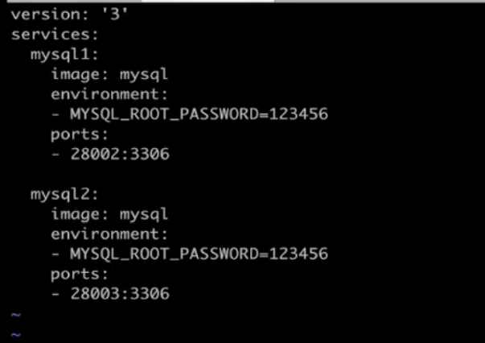
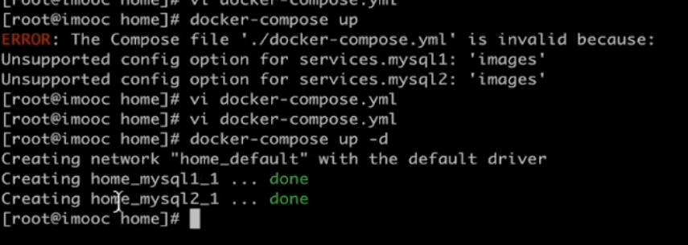
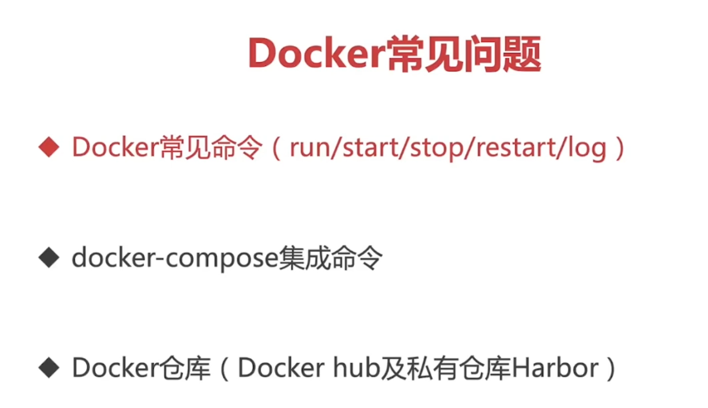
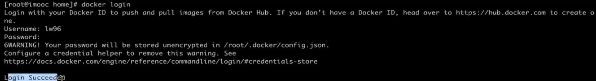
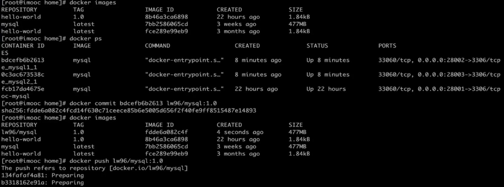

# Docker 入门

主要特性：

- 对文件、资源、网络隔离
- 变更管理、日志记录
- 写时复制（采用写时复制的方式去创建了根文件系统），让部署更加快速

安装Docker:

https://yeasy.gitbooks.io/docker_practice/install/centos.html


```shell
systemctl status docker
```


```shel
systemctl daemon-reload
```


```shell
systemctl stop docker
```


启动容器：

```shell
docker start imooc-mysql
```


查看日志

```s
docker log -f imooc-mysql
```


docker compose

一条命令运行多个镜像。



安装docker compose




创建docker-compose.yml

```shell
vi docker-compose.yml
```





```shell
docker-compose stop
```

```shell
docker-compose rm
```




docker hub



登录docker hub

可以将自己的镜像推送到docker hub上保存下来。



docker commit 有点类似git commit

```shell
docker commit 镜像id  远程镜像命名
```


如何建立一个私仓？

