# 大前端入门

## DevOps

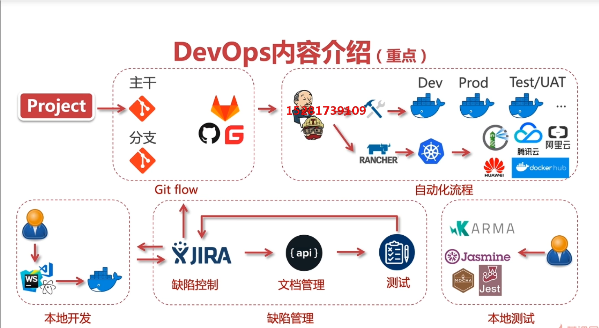

## 需求分析

- 项目全局思维，需求分析重难点
- 案例项目需求分析，业务拆解，功能拆解
- 需求分析的工具即使用介绍

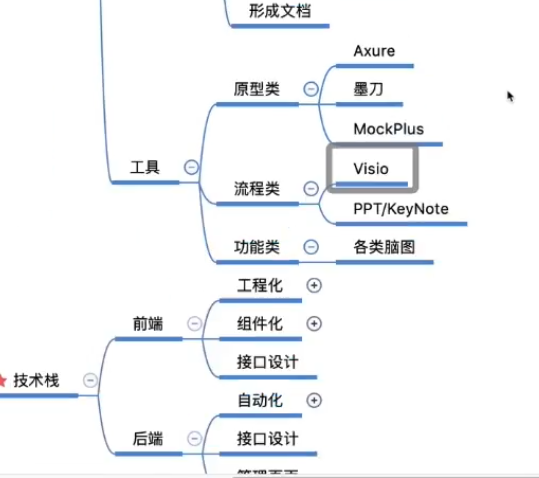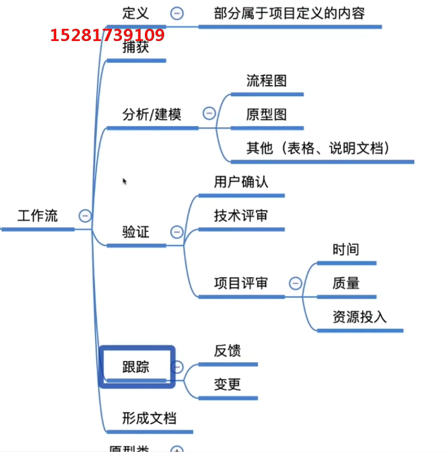

- 需求分析分析内容（从哪里来）
- 需求分析中重点的内容（抓痛点）
- 需求分析文档及工具（怎么做）

需求分析组成部分：

- 业务需求
- 用户需求
- 项目需求

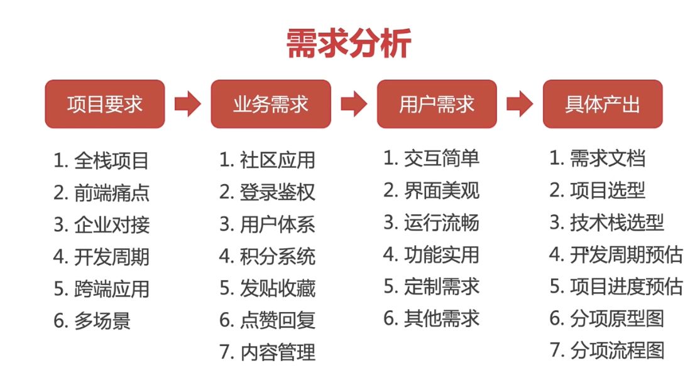

项目需求变更:

- 考虑是否合理
- 是否是项目范围内的变更，对主体业务是否有影响
- 明确需求变更的流程，确定需求变更

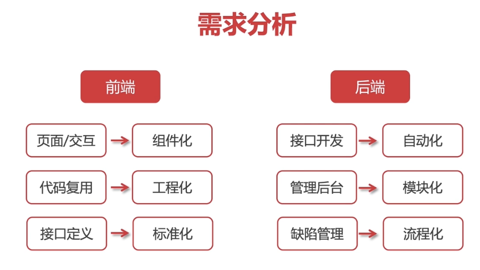

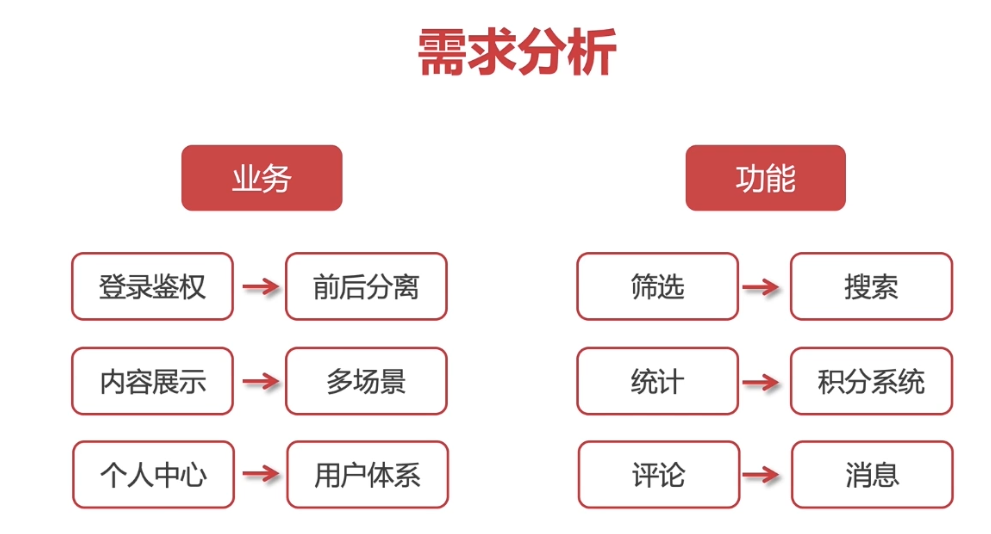

原型设计

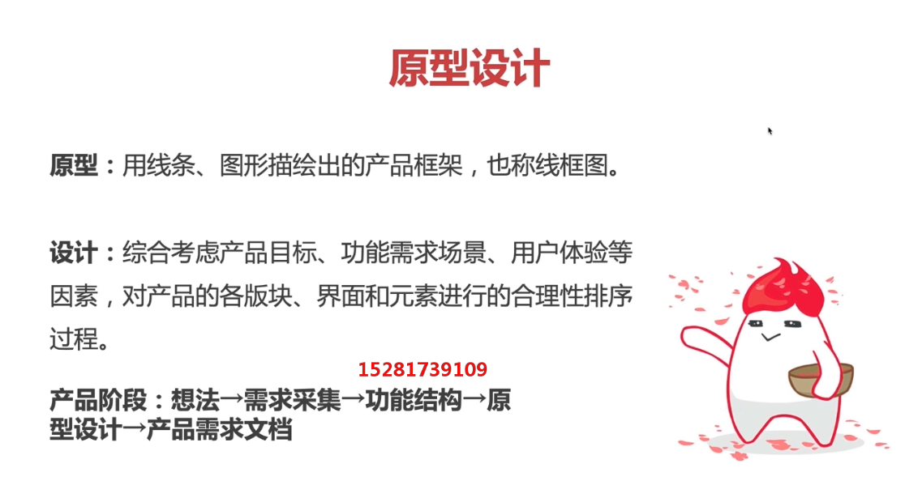

原型设计目标：

- 展现布局逻辑结构
- 表面状态关系与跳转关系
- 低成本的快速修改

PC端需求分析

设计网站推荐：

- [花瓣]([https://huaban.com](https://huaban.com/))
- [站酷](https://www.zcool.com.cn/)
- [蓝色理想](http://www.blueidea.com/)

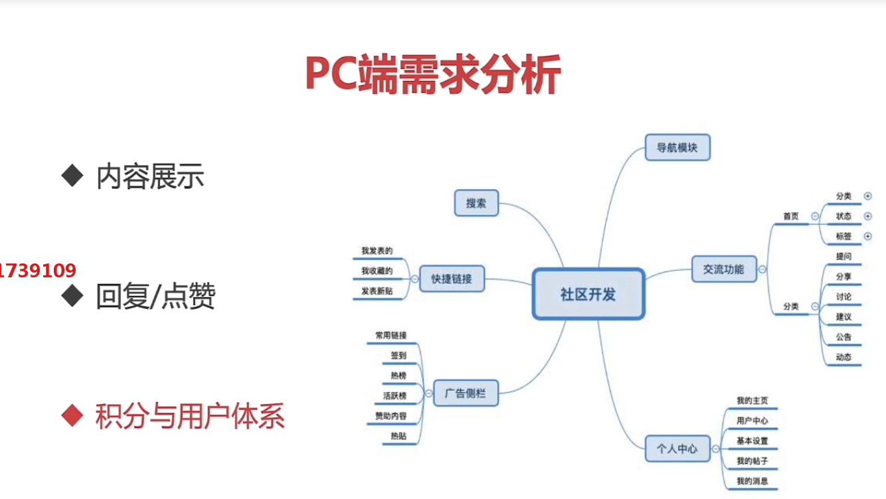

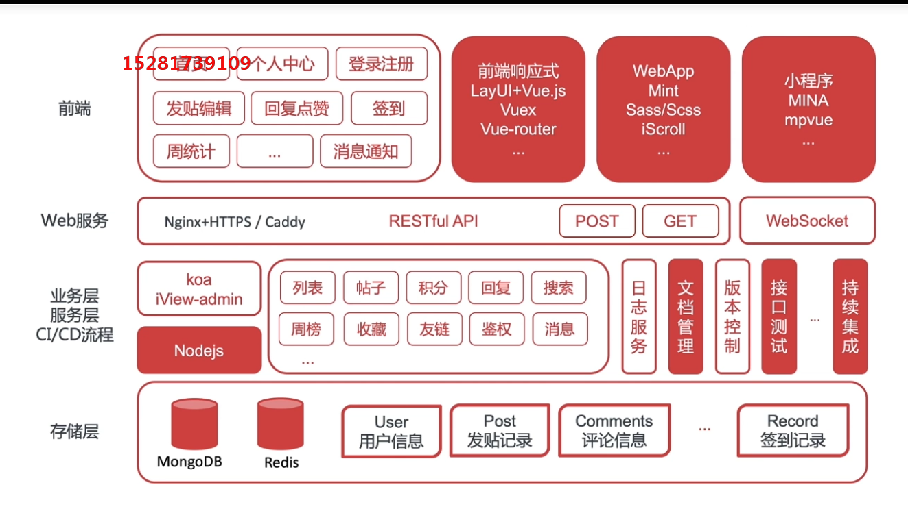

需求分析工具

- 原型类： Axure ， Ps ， 墨刀， 蓝湖
- 思维脑图： Xmind ， MindN0de （ Mac ） ， MindManager
- 流程图： Visi0 （ win ） 、/OmniGraffIe （ Mac ） / processOn

## 开发环境准备

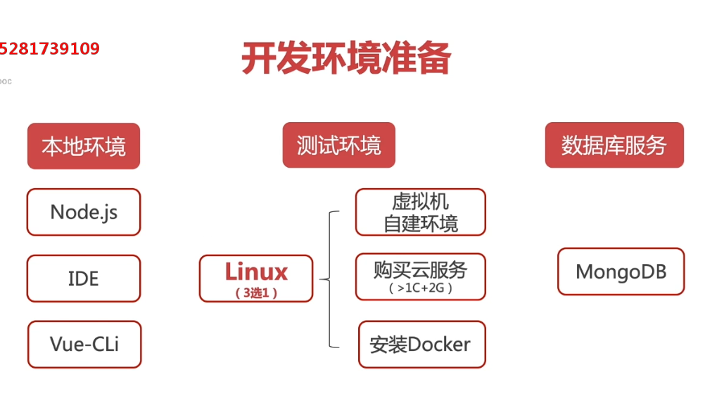

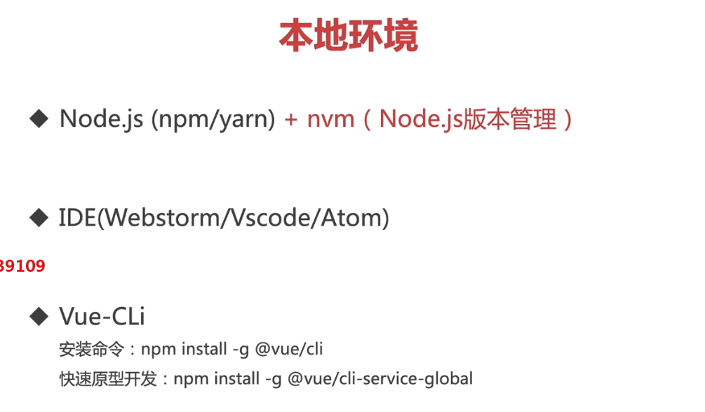

